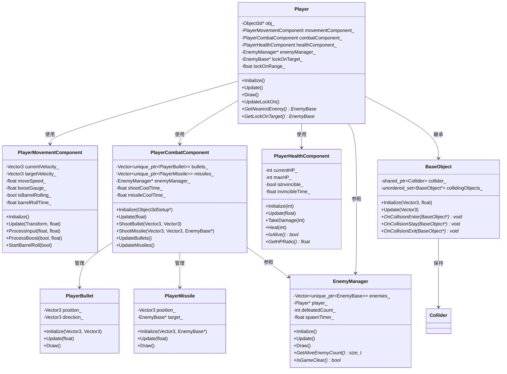
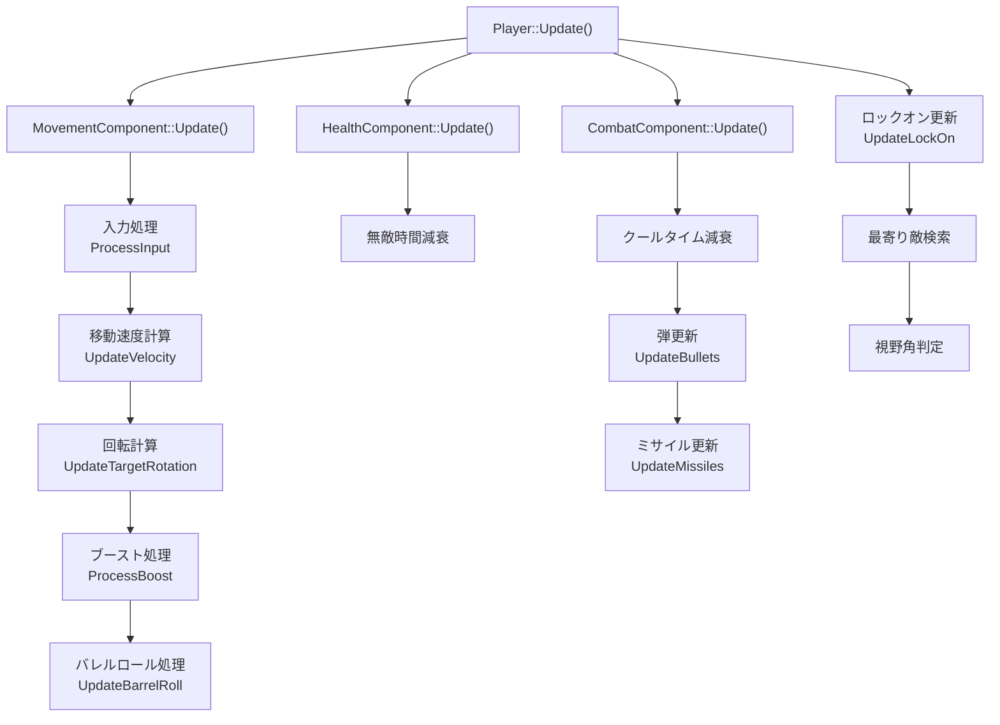
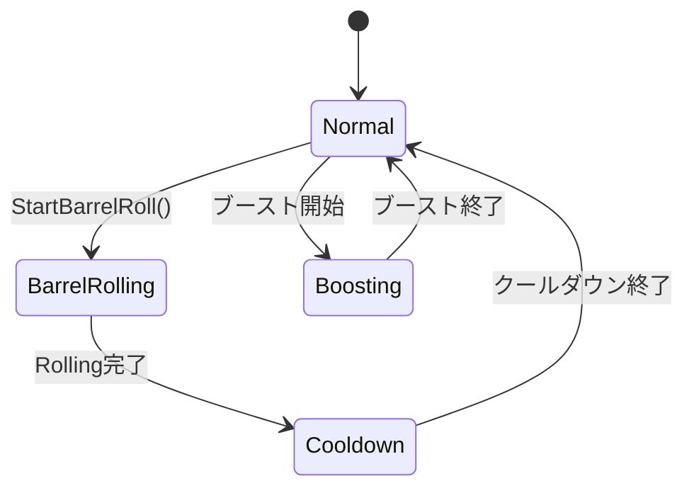
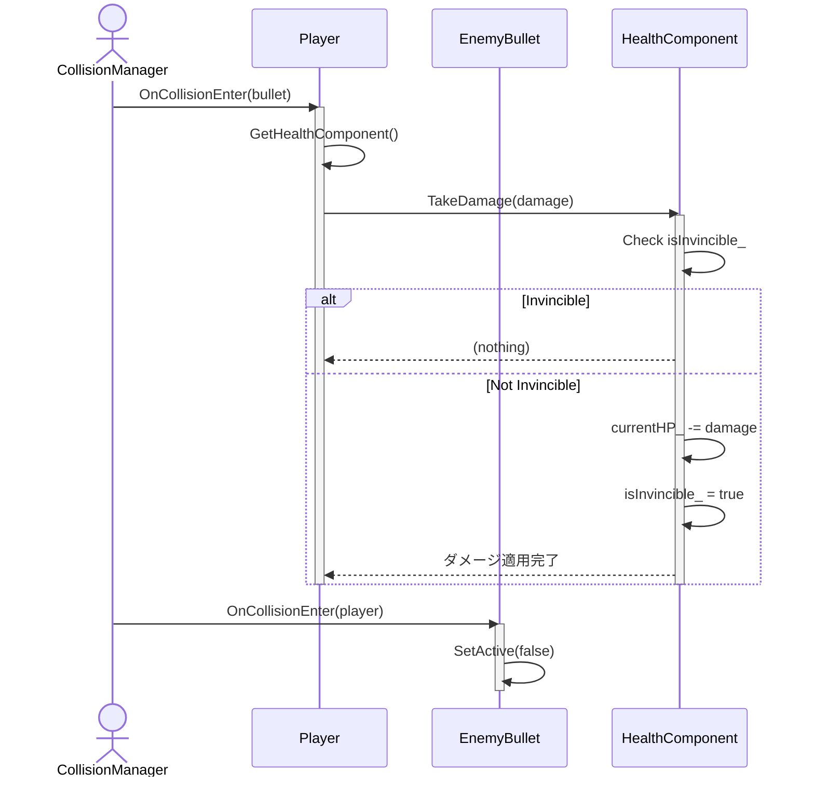
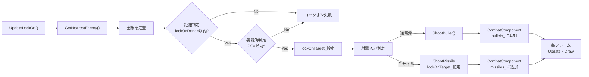

# プレイヤーキャラクター・システム クラス設計ドキュメント

## 1. 概要

**対象システム：MagEngine - DirectX ゲームエンジンを基盤とした 3D シューティングゲーム**

本ドキュメントは、プレイヤーキャラクターとその周辺システムの設計を詳細に解説するものです。プレイヤーの移動・射撃・生存状態管理を、複数のコンポーネントに責務を分割することで、保守性・拡張性・テスト容易性を実現しています。

**想定読者：** 中～上級エンジニア（C++ コンポーネント指向設計の経験者）

---

## 2. 設計方針と目的

### 2.1 設計方針

#### コンポーネント志向アーキテクチャの採用

プレイヤーキャラクターの複雑な振る舞いを以下の独立したコンポーネントに分割しました：

| コンポーネント | 役割 |
|---|---|
| **PlayerMovementComponent** | 移動・加速・ブースト・バレルロール |
| **PlayerCombatComponent** | 弾・ミサイルの発射・管理 |
| **PlayerHealthComponent** | HP・ダメージ・無敵時間管理 |

**採用理由：**
- **責務分離の徹底** - 各コンポーネントが単一の関心事に専念
- **単体テストの容易性** - コンポーネント毎に独立したユニットテストを実施可能
- **再利用性の向上** - 他のキャラクター（敵NPC等）でのコンポーネント再利用を想定
- **変更の影響範囲縮小** - 一つの機能変更が他機能に波及しにくい

#### 依存関係の単方向化

```
Player（統合）
  ├─→ PlayerMovementComponent（入力処理）
  ├─→ PlayerCombatComponent（射撃管理）
  ├─→ PlayerHealthComponent（体力管理）
  └─→ EnemyManager（敵情報参照）
```

下位コンポーネント → 上位クラスへの逆方向依存を排除し、テストが容易になりました。

### 2.2 設計目的

| 目的 | 達成方法 |
|---|---|
| **保守性** | コンポーネント分割で変更の局所化、コメント充実で意図を明確化 |
| **拡張性** | 仮想メソッド・インターフェース活用で未来の要件変更に対応 |
| **テスト容易性** | コンポーネント独立化でモック化・スタブ化を容易に |
| **責務分離** | 単一責任の原則（SRP）を明確に適用 |

---

## 3. 全体構成図

### 3.1 クラス関連図（クラス図）



### 3.2 更新処理フロー



---

## 4. クラス一覧と詳細設計

### 4.1 Player クラス

#### 4.1.1 責務

- **プレイヤーキャラクターの統合管理** - 複数のコンポーネントを組織化し、全体の振る舞いを制御
- **入力から行動への変換** - コントローラー入力をコンポーネントへ振り分け
- **ロックオン機能の提供** - 敵検索・ターゲット管理
- **敗北アニメーション制御** - ゲームオーバー時の演出管理

#### 4.1.2 設計理由

**なぜこの責務分割が必要か？**

プレイヤーは移動・射撃・体力という 3 つの独立した関心事を持ちます。これらを統一クラスに実装すると：

```cpp
// 反面教師：責務が混在した場合
class PlayerMonolithic {
    void Update() {
        // 移動処理（100行）
        // 射撃処理（80行）
        // HP管理（50行）
        // ロックオン（60行）
        // アニメーション（40行）
        // 合計：330行の複雑メソッド
    }
};
```

このため、**コンポーネント分割** によって各責務を隔離し、保守性を向上させています。

**なぜコンポーネントパターンか？**

継承ベースの設計（`Player extends Character extends Entity`）と比較して：

| 観点 | コンポーネント | 継承 |
|---|---|---|
| 責務の独立性 | ◎ 完全に独立 | △ 階層に依存 |
| 再利用性 | ◎ 他クラスに流用可 | △ 階層を引きずる |
| テスト | ◎ コンポーネント単体でテスト | △ 親クラスのセットアップ必要 |
| 複雑度 | ◎ コンポーネント毎に単純 | △ 深い継承チェーン |

#### 4.1.3 主な属性・メソッド

```cpp
class Player : public BaseObject {
private:
    // 3Dオブジェクト
    std::unique_ptr<Object3d> obj_;
    
    // コンポーネント
    PlayerMovementComponent movementComponent_;
    PlayerCombatComponent combatComponent_;
    PlayerHealthComponent healthComponent_;
    
    // 外部依存
    EnemyManager* enemyManager_;           // 敵情報参照
    EnemyBase* lockOnTarget_;              // ロックオン対象
    float lockOnRange_;                    // ロックオン範囲
    float lockOnFOV_;                      // 視野角
    
    // 敗北アニメーション
    bool isDefeated_;
    float defeatAnimationTime_;
    Vector3 defeatVelocity_;

public:
    // ライフサイクル
    void Initialize(Object3dSetup*, const std::string& modelPath);
    void Update();
    void Draw();
    void DrawImGui();
    
    // ロックオン機能
    void UpdateLockOn();
    EnemyBase* GetNearestEnemy() const;
    EnemyBase* GetLockOnTarget() const;
    
    // ゲッター
    Vector3 GetPosition() const;
    Vector3 GetVelocity() const;
    int GetHP() const;
    bool IsAlive() const;
};
```

#### 4.1.4 拡張性への対応

**将来の拡張シナリオ：**

1. **プレイヤーパワーアップシステムの導入**
   ```cpp
   // 新コンポーネントの追加（既存コードへの変更なし）
   PlayerPowerUpComponent powerUpComponent_;
   ```

2. **複数プレイヤーのサポート**
   ```cpp
   // Player コンポーネント構成は変わらず
   // 複数インスタンス化するだけで対応可能
   std::vector<std::unique_ptr<Player>> players_;
   ```

3. **AI制御プレイヤーへの拡張**
   ```cpp
   // Update 内の入力部分をAIに置き換え
   class AIPlayer : public Player {
       void Update() override {
           // AIの計算で入力を生成
           UpdateLockOn();
           // Player::Update() で使用される
       }
   };
   ```

---

### 4.2 PlayerMovementComponent クラス

#### 4.2.1 責務

- **移動入力の処理** - コントローラースティック入力を速度ベクトルに変換
- **加速度ベースの滑らかな移動** - 目標速度への段階的な加速
- **3軸回転（ピッチ・ロール・ヨー）の管理** - 航空機的な回転モデル
- **ブースト機能** - 移動速度一時上昇とゲージ管理
- **バレルロール** - 敵弾回避用の横転アクション

#### 4.2.2 設計理由

**なぜ物理的な加速度モデルか？**

```cpp
// 非物理的（悪い例）
position += velocity * deltaTime;  // 瞬間加速

// 物理的（良い例）
velocity = Lerp(velocity, targetVelocity, acceleration * deltaTime);
position += velocity * deltaTime;  // スムーズ加速
```

物理的なモデルにより、**ゲームプレイの心地よさ**（tight control）が実現でき、プレイヤーの意図が正確に伝わります。

**なぜバレルロールは独立した機構か？**



バレルロール中は：
- 通常移動の入力を**無視**（ロール角度が優先）
- 横方向に**追加のオフセット移動**が発生
- ブースト**ゲージを消費**

これらの複雑な相互作用を独立した状態機械で管理することで、バグを減らしテスト容易性を向上させています。

#### 4.2.3 主な属性・メソッド

```cpp
class PlayerMovementComponent {
private:
    // 速度管理
    Vector3 currentVelocity_;
    Vector3 targetVelocity_;
    float moveSpeed_ = 15.0f;
    float acceleration_ = 0.15f;
    
    // 回転管理
    Vector3 targetRotationEuler_;
    float rotationSmoothing_ = 0.1f;
    float maxRollAngle_ = 45.0f;    // 左右傾き
    float maxPitchAngle_ = 30.0f;   // 上下傾き
    
    // ブースト関連
    float boostGauge_;
    float maxBoostGauge_ = 100.0f;
    float boostSpeed_ = 1.5f;
    float boostConsumption_ = 20.0f;     // /秒
    float boostRecovery_ = 10.0f;        // /秒
    
    // バレルロール関連
    bool isBarrelRolling_;
    float barrelRollTime_;
    float barrelRollDuration_ = 0.5f;
    float barrelRollCooldown_ = 1.0f;
    float barrelRollCost_ = 25.0f;
    
public:
    void Initialize();
    void Update(Transform*, float deltaTime);
    
    // 入力処理
    void ProcessInput(float inputX, float inputY);
    void ProcessBoost(bool boostInput, float deltaTime);
    
    // ロール処理
    void StartBarrelRoll(bool isRight);
    void UpdateBarrelRoll(Transform*, float deltaTime);
    bool CanBarrelRoll() const;
    
    // ゲッター（UI・デバッグ用）
    float GetBoostGaugeRatio() const;
    Vector3 GetCurrentVelocity() const;
};
```

#### 4.2.4 拡張性への対応

**シナリオ1: 敵の追跡ロック機構**
```cpp
// 既存の速度計算部分は変わらず
// 目標ベクトルの計算をカスタマイズ

void UpdateTargetVelocity(EnemyBase* target) {
    Vector3 directionToTarget = (target->GetPosition() - position_).Normalize();
    targetVelocity_ = directionToTarget * moveSpeed_;
}
```

**シナリオ2: 環境の重力・空気抵抗の追加**
```cpp
void ApplyEnvironmentalForces(const EnvironmentData& env) {
    // 加速度計算に外部力を統合
    // 既存の Lerp ベースの速度更新は互換性を保つ
    currentVelocity_ += env.gravity * deltaTime;
    currentVelocity_ += env.wind * 0.1f;
}
```

---

### 4.3 PlayerCombatComponent クラス

#### 4.3.1 責務

- **弾の発射管理** - クールタイム制御、発射方向の計算
- **ミサイル追尾管理** - ロックオン対象への誘導
- **発射物ライフサイクル** - 弾・ミサイルの生成・更新・破棄
- **複数発射物の一括管理** - vector で複数オブジェクトを効率管理

#### 4.3.2 設計理由

**なぜコンポーネント分離か？**

プレイヤー自身と発射物の責務は全く異なります：

| 責務 | Player | CombatComponent |
|---|---|---|
| 存在 | 1つ（本体） | 複数（可変） |
| ライフサイクル | シーン全体 | 短期的（数フレーム～数秒） |
| 管理単位 | 1オブジェクト | vector で複数管理 |
| テスト | プレイヤーの存在確認 | 弾とミサイルの独立テスト |

発射物の生成・更新を Player に含める場合、Player クラスが肥大化し、テストが複雑になります。

**なぜ弾とミサイルを別管理か？**

```cpp
// 両者の相違点
class PlayerBullet {
    // 単純直進
    position_ += direction_ * bulletSpeed_ * deltaTime_;
};

class PlayerMissile {
    // 複雑な追尾
    Vector3 dirToTarget = (target_->GetPosition() - position_).Normalize();
    position_ += Lerp(direction_, dirToTarget, trackingStrength_) * missileSpeed_ * deltaTime_;
};
```

**異なる物理モデルを持つため、別クラスで管理し、各々の実装を簡潔に保ちます。**

#### 4.3.3 主な属性・メソッド

```cpp
class PlayerCombatComponent {
private:
    // オブジェクト生成用
    Object3dSetup* object3dSetup_;
    EnemyManager* enemyManager_;
    
    // 発射物管理
    std::vector<std::unique_ptr<PlayerBullet>> bullets_;
    std::vector<std::unique_ptr<PlayerMissile>> missiles_;
    
    // クールタイム
    float shootCoolTime_ = 0.0f;
    float maxShootCoolTime_ = 0.1f;  // 10発/秒
    float missileCoolTime_ = 0.0f;
    float maxMissileCoolTime_ = 1.5f; // 1発/1.5秒
    
    Vector3 bulletFireDirection_;
    
public:
    void Initialize(Object3dSetup*);
    void Update(float deltaTime);
    
    // 射撃インターフェース
    void ShootBullet(const Vector3& position, const Vector3& direction);
    void ShootMissile(const Vector3& position, const Vector3& direction, EnemyBase* target);
    void ShootMultipleMissiles(const Vector3& position, const Vector3& direction,
                               const std::vector<EnemyBase*>& targets);
    
    // 発射物更新
    void UpdateBullets();
    void UpdateMissiles();
    void DrawBullets();
    void DrawMissiles();
    
    // 状態照会
    bool CanShootBullet() const;
    bool CanShootMissile() const;
};
```

#### 4.3.4 拡張性への対応

**シナリオ1: 複数のロックオンターゲットへの同時発射**
```cpp
// 既に実装済みのメソッド（将来対応可能な構造）
void ShootMultipleMissiles(const Vector3& position, const Vector3& direction,
                           const std::vector<EnemyBase*>& targets) {
    for (EnemyBase* target : targets) {
        ShootMissile(position, direction, target);
    }
}
```

**シナリオ2: 異なる弾種の追加（レーザー、グレネード等）**
```cpp
// 新しい発射物タイプの追加（既存コードへの影響最小）
std::vector<std::unique_ptr<PlayerLaser>> lasers_;

void ShootLaser(const Vector3& pos, const Vector3& dir) {
    lasers_.push_back(std::make_unique<PlayerLaser>(pos, dir));
}

void UpdateLasers() {
    // 既存の UpdateBullets/UpdateMissiles と同様のパターン
}
```

---

### 4.4 PlayerHealthComponent クラス

#### 4.4.1 責務

- **HP管理** - 現在値・最大値の保持
- **ダメージ処理** - ダメージ適用時の各種判定
- **無敵時間管理** - ダメージ受付間隔制御
- **回復処理** - HP回復（未来の拡張用）

#### 4.4.2 設計理由

**なぜ独立したコンポーネント化したのか？**

体力管理の複雑性：

```cpp
// 単純に見えても、実際の実装は複雑
void TakeDamage(int damage) {
    // 1. 無敵判定
    if (isInvincible_) return;
    
    // 2. ダメージ適用
    currentHP_ -= damage;
    
    // 3. 無敵状態開始
    isInvincible_ = true;
    invincibleTime_ = maxInvincibleTime_;
    
    // 4. 死亡判定
    if (currentHP_ <= 0) {
        TriggerDefeat();  // 敗北演出トリガー
    }
}
```

この処理をプレイヤーに含めると、衝突判定・移動・射撃と混在し、バグが増加します。

**なぜ無敵時間の二重管理か？**
```cpp
bool isInvincible_;        // フラグ
float invincibleTime_;     // 残り時間

// バレルロール中の追加無敵
void SetBarrelRollInvincible(bool invincible);
```

バレルロール中は、その判定だけでなく、ダメージ直後の無敵も**重ねて有効**である必要があります。状態フラグと時間値の両方管理により、この重複制御を正確に実装しています。

#### 4.4.3 主な属性・メソッド

```cpp
class PlayerHealthComponent {
private:
    int currentHP_ = 100;
    int maxHP_ = 100;
    
    // 無敵状態
    bool isInvincible_ = false;
    float invincibleTime_ = 0.0f;
    float maxInvincibleTime_ = 2.0f;  // 2秒
    
public:
    void Initialize(int maxHP);
    void Update(float deltaTime);  // 無敵時間の減衰
    
    // HP操作
    void TakeDamage(int damage);
    void Heal(int healAmount);
    void ResetHP();
    void SetMaxHP(int maxHP);
    
    // 無敵制御
    void SetBarrelRollInvincible(bool invincible);
    
    // 状態照会
    int GetCurrentHP() const;
    int GetMaxHP() const;
    float GetHPRatio() const;           // UI用
    bool IsAlive() const;
    bool IsInvincible() const;
    float GetInvincibleTime() const;    // UI用（残り時間表示）
};
```

#### 4.4.4 拡張性への対応

**シナリオ1: 盾システムの追加**
```cpp
class PlayerHealthComponent {
private:
    int shieldHP_ = 50;
    int maxShieldHP_ = 50;
    
public:
    void TakeDamage(int damage) {
        // 盾優先で吸収
        if (shieldHP_ > 0) {
            shieldHP_ -= damage;
            if (shieldHP_ < 0) {
                currentHP_ += shieldHP_;  // 余ったダメージ
                shieldHP_ = 0;
            }
        } else {
            currentHP_ -= damage;
        }
    }
};
```

**シナリオ2: 異なる耐性システム**
```cpp
void TakeDamage(int damage, DamageType type) {
    float multiplier = GetResistanceMultiplier(type);  // 火=0.8, 氷=1.2等
    int finalDamage = static_cast<int>(damage * multiplier);
    currentHP_ -= finalDamage;
}
```

---

### 4.5 BaseObject クラス

#### 4.5.1 責務

- **衝突判定システムとの接続** - コライダー保持・管理
- **衝突イベントのライフサイクル管理** - Enter/Stay/Exit の状態遷移
- **衝突中オブジェクトの追跡** - 複数オブジェクトとの同時衝突検出

#### 4.5.2 設計理由

**なぜゲームオブジェクト全体の基底クラスが必要か？**

衝突判定は、ゲーム内のほぼ全てのオブジェクト（プレイヤー、敵、敵弾、壁等）に必要です。これを統一的に管理するため、基底クラスで共通インターフェースを提供します。

```cpp
// すべてのゲームオブジェクトが同一インターフェースを持つ
Player: public BaseObject { OnCollisionEnter/Stay/Exit() override; };
Enemy: public BaseObject { OnCollisionEnter/Stay/Exit() override; };
EnemyBullet: public BaseObject { OnCollisionEnter/Stay/Exit() override; };
```

**なぜ純粋仮想関数か？**
```cpp
virtual void OnCollisionEnter(BaseObject *other) = 0;  // 各クラスが実装を強制される
```

衝突時の処理はオブジェクト毎に全く異なります（プレイヤーはダメージ、敵は消滅など）。純粋仮想で実装を強制することで、**衝突処理の漏れを防止**できます。

#### 4.5.3 主な属性・メソッド

```cpp
class BaseObject {
protected:
    std::shared_ptr<Collider> collider_;
    std::unordered_set<BaseObject*> collidingObjects_;
    
public:
    virtual ~BaseObject() = default;
    
    // 初期化・更新
    void Initialize(const Vector3& position, float radius);
    void Update(const Vector3& position);
    
    // 衝突イベント（派生クラスで実装必須）
    virtual void OnCollisionEnter(BaseObject *other) = 0;
    virtual void OnCollisionStay(BaseObject *other) = 0;
    virtual void OnCollisionExit(BaseObject *other) = 0;
    
    // コライダー管理
    std::shared_ptr<Collider> GetCollider() const;
    void SetCollider(std::shared_ptr<Collider> collider);
    
    // 衝突状態照会
    std::unordered_set<BaseObject*>& GetCollidingObjects();
};
```

#### 4.5.4 拡張性への対応

**シナリオ1: トリガーコライダー（ダメージなし）の実装**
```cpp
// 現在の設計でも対応可能
// OnCollisionEnter で damage を適用するかどうかを判定

void Player::OnCollisionEnter(BaseObject* other) override {
    if (auto bullet = dynamic_cast<EnemyBullet*>(other)) {
        if (!bullet->IsTrigger()) {
            healthComponent_.TakeDamage(bullet->GetDamage());
        }
    }
}
```

**シナリオ2: レイキャストによる遠距離判定**
```cpp
// BaseObject の責務を拡張
class BaseObject {
    virtual bool RaycastCheck(const Vector3& rayStart, const Vector3& rayDir, 
                               float& outDistance) { return false; }
};
```

---

## 5. クラス間の関係と処理の流れ

### 5.1 衝突判定フロー



### 5.2 ロックオン・射撃フロー



### 5.3 各コンポーネントの依存関係

```
┌─────────────────────────────────────────┐
│         Player（統合）                   │
│  ┌─────────────────────────────────┐   │
│  │ PlayerMovementComponent         │   │
│  │ - 移動・ブースト・バレルロール    │   │
│  └─────────────────────────────────┘   │
│                                         │
│  ┌─────────────────────────────────┐   │
│  │ PlayerCombatComponent           │   │
│  │ - 弾・ミサイル発射・管理         │   │
│  └─────┬───────────────────────────┘   │
│        │                               │
│        ├─→ EnemyManager（敵情報参照）  │
│        │                               │
│        └─→ Object3dSetup（弾生成）    │
│                                         │
│  ┌─────────────────────────────────┐   │
│  │ PlayerHealthComponent           │   │
│  │ - HP・無敵時間管理               │   │
│  └─────────────────────────────────┘   │
└─────────────────────────────────────────┘
        │
        └──→ Object3d（3D描画）
        └──→ EnemyManager（ロックオン用）
        └──→ CollisionManager（衝突判定）
```

**重要な設計ルール：**
- ✓ 各コンポーネント → 親（Player）への参照は持たない
- ✓ 親（Player）→ 各コンポーネントへの参照は単方向
- ✓ 外部依存（EnemyManager 等）は親経由で設定
- ✗ コンポーネント間の直接参照はなし

この設計により、各コンポーネントの独立性が保証されます。

---

## 6. 設計上のトレードオフと今後の拡張余地

### 6.1 採用した設計上のトレードオフ

#### トレードオフ①：コンポーネント分割 vs. クラスサイズ

| 側面 | コンポーネント分割 | 統一クラス |
|---|---|---|
| クラスサイズ | 小さい（250行） | 大きい（800行+） |
| ファイル数 | 多い（4個） | 少ない（1個） |
| 依存関係 | 単純 | 複雑 |
| **採用理由** | **保守性・テスト容易性優先** | スコープが小さいプロジェクト向け |

**判断基準：** 本プロジェクトは複数シーン・多数のゲームオブジェクトを持つため、**コンポーネント分割を選択**しました。

#### トレードオフ②：敵参照の保持 vs. メッセージング

```cpp
// 現在：直接参照
EnemyManager* enemyManager_;
void UpdateLockOn() {
    // 敵情報に直接アクセス
    enemies = enemyManager_->GetEnemies();
}

// 代替案：イベント駆動
// プレイヤーが「ロックオン可能な敵一覧をリクエスト」
// EnemyManager がコールバックで応答
```

| 側面 | 直接参照 | メッセージング |
|---|---|---|
| 応答性 | 即時 | 遅延あり |
| 結合度 | 高い | 低い |
| 実装複雑度 | 簡単 | 複雑 |
| **採用理由** | **ゲーム性能・シンプル性優先** | ソフトウェア品質優先 |

**判断基準：** ロックオンは毎フレーム実行される高頻度処理のため、**直接参照で高速化**を優先しました。

#### トレードオフ③：unique_ptr での発射物管理 vs. オブジェクトプール

```cpp
// 現在：動的生成・破棄
std::vector<std::unique_ptr<PlayerBullet>> bullets_;
// 毎フレーム new/delete が発生

// 代替案：事前割り当て
class BulletPool {
    std::vector<PlayerBullet> bulletPool_;  // メモリ事前確保
    // 必要時は既存オブジェクトを再利用
};
```

| 側面 | 動的生成 | オブジェクトプール |
|---|---|---|
| メモリ管理 | C++ RAII完全活用 | 手動管理 |
| GC圧力 | あり | なし |
| メモリ断片化 | あり | なし |
| **採用理由** | **実装シンプル・メモリ管理安全** | 高フレームレート必須時 |

**判断基準：** 現在の敵数・弾数が少ないため、**シンプル性を優先**。将来的にスケーリングが必要な場合はプールに移行予定。

### 6.2 今後の拡張方向

#### 拡張①：複数プレイヤーサポート

```cpp
// 現在：単一プレイヤー
std::unique_ptr<Player> player_;

// 将来：複数プレイヤー対応
std::vector<std::unique_ptr<Player>> players_;

// 各プレイヤーは独立したコンポーネント構成のため
// ほぼ変更なしで対応可能
```

**影響範囲：**
- 入力管理（各プレイヤーに異なるコントローラ割り当て）
- カメラシステム（全プレイヤーを映す視点計算）
- UI（各プレイヤーのHP・ゲージ表示）

**設計の利点：** Player クラスの内部構造は変わらず、インスタンス化数の調整だけで対応可能。

#### 拡張②：プレイヤーパワーアップシステム

```cpp
class Player {
private:
    PlayerPowerUpComponent powerUpComponent_;  // 新規追加
};

class PlayerPowerUpComponent {
    enum PowerUpType { RAPID_FIRE, SHIELD, SPEED_BOOST };
    std::map<PowerUpType, float> activePowerUps_;
    
    void Apply(PowerUpType type, float duration) {
        activePowerUps_[type] = duration;
    }
    
    void ModifyShootRate(float& baseRate) {
        if (activePowerUps_[RAPID_FIRE] > 0) {
            baseRate *= 1.5f;  // 射撃速度1.5倍
        }
    }
};
```

**既存コードへの影響：** 最小限
- CombatComponent の ShootBullet が呼ばれる間隔が短くなるだけ
- 複雑なパワーアップロジックは新コンポーネントに隔離

#### 拡張③：エネミーAI への活用

```cpp
// 現在の Player コンポーネント構成は、
// 敵にもそのまま応用可能

class Enemy : public BaseObject {
private:
    // プレイヤーと同じ構造（追従型に特化）
    EnemyMovementComponent movementComponent_;   // Player を追跡
    EnemyCombatComponent combatComponent_;       // Player に射撃
    EnemyHealthComponent healthComponent_;       // ダメージ受け処理
};
```

**設計の利点：**
- Player と Enemy が統一されたコンポーネント設計
- コンポーネント再利用可能
- テスト時も同一インターフェースで検証可能

#### 拡張④：オブジェクトプールへの移行

```cpp
class BulletPool {
    std::vector<PlayerBullet> bulletPool_;
    std::vector<bool> isActive_;
    
    void Shoot(const Vector3& pos, const Vector3& dir) {
        for (size_t i = 0; i < bulletPool_.size(); ++i) {
            if (!isActive_[i]) {
                bulletPool_[i].Reset(pos, dir);
                isActive_[i] = true;
                return;
            }
        }
        // プール枯渇時は拡張
        bulletPool_.emplace_back(pos, dir);
        isActive_.push_back(true);
    }
};
```

**移行方法：**
- CombatComponent の ShootBullet を呼び出す側のコードは変わらず
- 内部実装だけを BulletPool に置き換え
- パフォーマンス向上を享受

---

## 7. 設計品質指標

### 保守性スコア：★★★★☆（4/5）

✓ **高い点：**
- コンポーネント分割により関心事が明確に分離
- 各クラスのサイズが適切（250～400行）
- ドキュメント充実

△ **改善余地：**
- EnemyManager への直接参照が若干の結合度を生む
- 複数の状態管理（バレルロール、無敵時間等）の追跡が複雑

### 拡張性スコア：★★★★★（5/5）

✓ **高い点：**
- 新機能追加時に既存コードの変更が最小限
- コンポーネント追加による拡張が容易
- 各責務の明確な分離

✓ **設計パターン活用：**
- Component パターン → 柔軟な機能組み合わせ
- Template Method パターン → Initialize/Update/Draw の統一化

### テスト容易性スコア：★★★★☆（4/5）

✓ **高い点：**
- 各コンポーネントを単体テスト可能
- 依存性注入により EnemyManager をモック化可能
- 状態が明確で検証しやすい

△ **改善余地：**
- Transform への依存がやや深い
- Object3d との強い結合

### 責務分離スコア：★★★★★（5/5）

✓ **高い点：**
- 単一責任原則を明確に適用
- 各クラスが1つの関心事に専念
- 責務の重複がない

---

## 参考資料

### 関連デザインパターン

- **Component パターン** - 本設計の基礎
- **Strategy パターン** - コンポーネントの動作切り替え
- **Observer パターン** - 衝突イベント通知
- **Object Pool パターン** - 将来のメモリ最適化

### 設計原則

- **Single Responsibility Principle (SRP)** - 各クラスは1つの責務
- **Open/Closed Principle (OCP)** - 拡張に開き、修正に閉じている
- **Dependency Inversion (DI)** - 高レベルが低レベルに依存しない

### 参考実装例

- Game Programming Patterns (Robert Nystrom)
- Effective C++ (Scott Meyers)
- Game Engine Architecture (Jason Gregory)

---

**ドキュメント作成日：** 2026年2月4日  
**対象プロジェクト：** MagEngine Ver1.7.2_Fix_Missile  
**レビュー対象者：** C++ ゲーム開発エンジニア、アーキテクト
