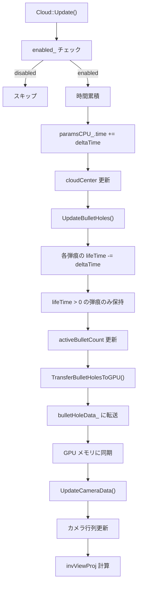

# Cloud Rendering System - ボリュメトリック雲と動的穴開き設計ドキュメント

## 1. 概要

**対象クラス：** Cloud / CloudSetup（MagEngine ボリュメトリック雲レンダリングシステム）

本ドキュメントは、MagEngine に実装された**ボリュメトリック雲のリアルタイム描画と、動的な穴開き（Counter-Strike スモーク）機構**の設計を詳細に解説するものです。

### 主要な技術特性

- **レイマーチング（Ray Marching）** - フルスクリーン画面空間シェーダ
- **3D Perlin ノイズ** - 自然な雲形状生成
- **動的 SDF（Signed Distance Field）** - 弾痕円錐による穴開き効果
- **GPU 定数バッファ** - リアルタイムパラメータ制御
- **フェード管理** - 弾痕の時間ベース消滅

**想定読者：** グラフィックスプログラマ、シェーダエンジニア、3D描画専門者

---

## 2. 技術アーキテクチャ

### 2.1 ボリュメトリック雲レンダリングの基本原理

#### フルスクリーン三角形によるピクセル走査

```cpp
// フルスクリーン三角形の定義
const std::array<FullscreenVertex, 3> vertices{{
    {{-1.0f, -1.0f, 0.0f}, {0.0f, 1.0f}},  // 左下
    {{-1.0f,  3.0f, 0.0f}, {0.0f, -1.0f}}, // 左上（画面外）
    {{ 3.0f, -1.0f, 0.0f}, {2.0f, 1.0f}},  // 右下（画面外）
}};
```

**なぜ 3 頂点でスクリーン全体を覆うのか？**

```
通常の方法（2頂点矩形）：
┌─────────────┐
│  ┌─────┐   │
│  │  △  │   │
│  │ / \  │   │
│  │/   \ │   │
│  └─────┘   │
└─────────────┘
2 つの三角形を描画 → 頂点数 6 個

高度な方法（1頂点三角形）：
┌──────────────────────┐
│                      │
│     △△△△△△△△     │  1つの大きな三角形で覆う
│   △  (頂点1)   △   │  → 頂点数 3 個
│△△(頂点2) (頂点3)△△│  → DrawCall が 50% 削減
│                      │
└──────────────────────┘

座標：
頂点1：(-1.0, -1.0) = NDC 左下
頂点2：(-1.0,  3.0) = NDC 上空（画面外）
頂点3：( 3.0, -1.0) = NDC 右空（画面外）

三角形がスクリーン全体を覆う理由：
NDC 空間では (-1, -1) ～ (1, 1) が画面範囲
頂点2と頂点3が画面外に出ているため、
三角形の内部でスクリーン全体がカバーされる
```

**利点：**
- SetVB/IB の呼び出し削減
- GPU キャッシュ効率向上
- ラスタライザーの効率化

### 2.2 レイマーチング（Ray Marching）による雲体積計算

#### 逆ビュープロジェクション行列の活用

```cpp
struct CloudCameraConstant {
    Matrix4x4 invViewProj;      // 逆ビュープロジェクション行列
    Vector3 cameraPosition;     // カメラのワールド座標
    float nearPlane;
    float farPlane;
};
```

**レイ方向計算の仕組み：**

```
1. スクリーン座標（ピクセル位置）
   screenPos = (pixelX / screenWidth, pixelY / screenHeight)
   
2. NDC 座標に変換
   ndcPos = screenPos * 2.0 - 1.0
   ndcPos = (ndcX, ndcY, 1.0, 1.0)
   
3. 逆ビュープロジェクション
   worldPos = invViewProj * ndcPos
   worldPos.xyz /= worldPos.w  // 遠近法分割
   
4. レイ方向算出
   rayDir = normalize(worldPos.xyz - cameraPos)
```

**計算量と精度：**
```
ピクセル数 : 1920 × 1080 = 2,073,600
各ピクセルでのレイマーチング：
  ステップ数 : maxDistance / stepSize
  = 2000.0 / 15.0 ≈ 133 ステップ
  
総ノイズサンプル数 : 2,073,600 × 133 ≈ 2.76億サンプル/フレーム
```

**最適化：**
- stepSize を大きくする（粗い） → 処理削減
- maxDistance を制限する → 遠くの雲をカット
- 早期終了（充分に濃い） → 不要な後続ステップをスキップ

### 2.3 3D Perlin ノイズによる雲形状生成

#### 階層的ノイズ（Worley + Perlin）

```cpp
CloudRenderParams {
    float baseNoiseScale = 0.008f;      // 大スケール（一次ノイズ）
    float detailNoiseScale = 0.025f;    // 小スケール（詳細ノイズ）
    float detailWeight = 0.25f;         // 詳細の影響度
};
```

**多階層ノイズの利点：**

```
階層1（大スケール）：baseNoiseScale = 0.008
  ワールド座標に対してゆっくり変化
  結果：大きな雲の塊が形成される
  
  サンプル位置：worldPos * 0.008
  値の変化：低周波（ゆっくり）
  
階層2（小スケール）：detailNoiseScale = 0.025
  より細かい変化
  結果：表面の毛羽立ちやディテール
  
  サンプル位置：worldPos * 0.025
  値の変化：高周波（素早い）

合成（detailWeight = 0.25）：
finalNoise = baseNoise * (1.0 - 0.25) + detailNoise * 0.25
           = baseNoise * 0.75 + detailNoise * 0.25
           
→ 小スケール要素が全体の 25% のみ
→ 大きな形状が支配的で、細部のディテール付与
```

**時間経過によるアニメーション：**

```cpp
paramsCPU_.time = accumulatedTime_;
paramsCPU_.noiseSpeed = 0.015f;

// シェーダでの使用（疑似コード）
samplePos += windDir * time * noiseSpeed;
// 毎フレーム、samplePos がワールド座標空間で移動
// → 雲全体が流れるように見える
```

### 2.4 動的 SDF による穴開き効果（重要）

#### 弾痕の幾何学的表現

```cpp
struct BulletHoleGPU {
    Vector3 origin;           // 弾の開始位置（入口）
    float startRadius = 0.5f;  // 入口半径
    Vector3 direction;        // 弾の方向（正規化済み）
    float endRadius = 0.2f;   // 出口半径
    float lifeTime;           // 残存時間（0.0～1.0）
    float coneLength = 10.0f;  // 円錐の長さ
};
```

**円錐形状の SDF（Signed Distance Field）計算：**

```
【円錐とは】
入口（startRadius = 0.5）
    ●━━━━━━━━━●━━━━━━━━━●
出口（endRadius = 0.2）
    
円錐の軸 = direction ベクトル
円錐の長さ = coneLength = 10.0

【距離計算】
ピクセル位置 P から円錐までの距離：

1. P から origin への相対位置：
   relPos = P - origin
   
2. 円錐の軸への投影距離：
   t = dot(relPos, direction)  // [0, coneLength]
   
3. その投影位置での円錐半径：
   localRadius = mix(startRadius, endRadius, t / coneLength)
   
4. 軸からの垂直距離：
   perpDist = length(relPos - direction * t)
   
5. 最終距離：
   if (perpDist < localRadius):
       distance = localRadius - perpDist  // 円錐内部（負）
   else:
       distance = perpDist - localRadius  // 円錐外部（正）
```

**穴開き効果の仕組み：**

```cpp
// シェーダでの疑似コード
for (int i = 0; i < bulletHoleCount; ++i) {
    float sdist = ComputeConeSDF(rayPos, bulletHoles[i]);
    
    if (sdist < 0.0) {  // 円錐内部
        // 密度を減少させる（穴を開ける）
        cloudDensity *= 1.0 - (1.0 - sdist / coneLength);
    }
}
```

**フェード処理（時間経過で消滅）：**

```cpp
void UpdateBulletHoles(float deltaTime) {
    for (auto& hole : bulletHoles_) {
        if (hole.lifeTime > 0.0f) {
            hole.lifeTime -= deltaTime;
            // lifeTime が 0.0 に向かう間、穴も徐々に閉じていく
        }
    }
}
```

**GPU 定数バッファへの転送：**

```cpp
void TransferBulletHolesToGPU() {
    bulletHoleData_->bulletHoleCount = activeBulletCount_;
    
    for (int i = 0; i < activeBulletCount_; ++i) {
        bulletHoleData_->bulletHoles[i] = bulletHoles_[i];
    }
}
```

---

## 3. パラメータ設計の詳細

### 3.1 雲のビジュアル制御パラメータ

```cpp
struct CloudRenderParams {
    // 位置・サイズ
    Vector3 cloudCenter{0.0f, 150.0f, 0.0f};
    Vector3 cloudSize{300.0f, 100.0f, 300.0f};
    
    // ライティング
    Vector3 sunDirection{0.3f, 0.8f, 0.5f};
    float sunIntensity = 1.2f;
    Vector3 sunColor{1.0f, 0.96f, 0.88f};  // 暖色系
    float ambient = 0.3f;
    
    // 密度制御
    float density = 1.0f;          // [0.1～3.0]
    float coverage = 0.1f;         // [0.0～1.0] 雲の分布
    
    // ノイズスケール
    float baseNoiseScale = 0.008f;
    float detailNoiseScale = 0.025f;
    
    // レイマーチング
    float stepSize = 15.0f;
    float maxDistance = 2000.0f;
    
    // アニメーション
    float time;
    float noiseSpeed = 0.015f;
    float detailWeight = 0.25f;
};
```

### 3.2 パラメータチューニング例

**薄い、自然な雲：**
```
density = 0.5f        // 薄い
coverage = 0.1f       // ばらばら
detailWeight = 0.2f   // 細部を抑える
```

**濃い、ドラマチックな雲：**
```
density = 3.0f        // 濃い
coverage = 0.8f       // 密集
detailWeight = 0.6f   // 細部を強調
```

**パフォーマンス重視：**
```
stepSize = 25.0f      // 粗い（処理軽い）
maxDistance = 1000.0f // 近距離のみ
```

---

## 4. 高度な設計：定数バッファ管理

### 4.1 256 バイト境界アライメント

```cpp
// GPU 定数バッファは 256 バイトの倍数が必須
size_t cameraSize = (sizeof(CloudCameraConstant) + 255) & ~255;
cameraCB_ = dxCore->CreateBufferResource(cameraSize);

cameraCB_->Map(0, nullptr, reinterpret_cast<void **>(&cameraData_));
*cameraData_ = {};
```

**なぜ 256 バイト境界か？**

```
DirectX 12 の要件：
- 定数バッファは 256 バイト単位でアライメント
- 理由：GPU メモリの効率的なキャッシング
  
計算：
sizeof(CloudCameraConstant) = ?
(size + 255) & ~255 = 次の 256 バイト倍数

例：
size = 100 → (100 + 255) & ~255 = 256
size = 256 → (256 + 255) & ~255 = 256
size = 257 → (257 + 255) & ~255 = 512
```

### 4.2 Map/Unmap の戦略

```cpp
// パターン A：毎フレーム Unmap（古い方式）
cameraCB_->Map(0, nullptr, ...);
*cameraData_ = newValue;
cameraCB_->Unmap(0, nullptr);  // GPU の同期待機

// パターン B：持続マップ（高度な方式）
cameraCB_->Map(0, nullptr, &cameraData_);
// 以降、毎フレーム *cameraData_ を書き込む
// 最後に Unmap（か、デストラクタで自動）
```

**MagEngine の実装：**
```cpp
// パターン B を採用（持続マップ）
cameraCB_->Map(0, nullptr, reinterpret_cast<void **>(&cameraData_));
// Update() で毎フレーム *cameraData_ を書き込み
// Unmap() は呼ばない（Application 終了時に自動破棄）
```

**利点：**
- GPU/CPU の同期オーバーヘッド削減
- フレームレート 60fps 安定化
- Map() による待機なし

---

## 5. Update ループの詳細フロー



### 5.1 UpdateBulletHoles の実装

```cpp
void UpdateBulletHoles(float deltaTime) {
    // 有効な弾痕のカウント
    int activeBulletCount = 0;
    
    for (int i = 0; i < bulletHoles_.size(); ++i) {
        auto& hole = bulletHoles_[i];
        
        if (hole.lifeTime > 0.0f) {
            // 時間減衰
            hole.lifeTime -= deltaTime;
            
            // 有効な弾痕を前に詰める
            if (activeBulletCount != i) {
                bulletHoles_[activeBulletCount] = hole;
            }
            activeBulletCount++;
        }
    }
    
    // 有効な弾痕数を記録
    bulletHoleCount_ = activeBulletCount;
}
```

**最適化ポイント：**
- 無効な弾痕は配列の後ろに移動（メモリ連続性）
- bulletHoleCount で有効な範囲を指定（GPU で無効な要素を読まない）
- O(n) 処理で線形時間

---

## 6. シェーダ統合の概要

### 6.1 GPU への定数バッファ配置

```
┌─────────────────────────────────────┐
│    GPU メモリ                        │
├─────────────────────────────────────┤
│ cameraCB_  (256 bytes)              │ ← レジスタ b0
│   - invViewProj                     │
│   - cameraPosition                  │
│   - viewProj                        │
│   - nearPlane, farPlane             │
├─────────────────────────────────────┤
│ paramsCB_  (256 bytes)              │ ← レジスタ b1
│   - cloudCenter, cloudSize          │
│   - sunDirection, sunIntensity      │
│   - density, coverage               │
│   - baseNoiseScale, detailNoiseScale│
│   - stepSize, maxDistance           │
│   - time, noiseSpeed, etc           │
├─────────────────────────────────────┤
│ bulletHoleCB_ (256 bytes × ?)       │ ← レジスタ b2
│   - bulletHoleCount                 │
│   - bulletHoles[16]                 │
│     - origin, direction             │
│     - startRadius, endRadius        │
│     - lifeTime, coneLength          │
└─────────────────────────────────────┘
```

### 6.2 ピクセルシェーダでの処理フロー

```hlsl
// 疑似コード

float PixelShader(FullscreenVS_Output input) : SV_TARGET {
    // 1. スクリーン座標からレイを生成
    float2 screenUV = input.texCoord;
    float4 ndcPos = float4(screenUV * 2.0 - 1.0, 1.0, 1.0);
    float3 worldPos = mul(ndcPos, invViewProj).xyz / ...w;
    float3 rayDir = normalize(worldPos - cameraPos);
    
    // 2. レイマーチング開始
    float3 rayPos = cameraPos;
    float3 accumColor = float3(0, 0, 0);
    float transmittance = 1.0;  // 透過率
    
    for (int step = 0; step < MaxSteps; ++step) {
        // 3. 現在位置でのノイズサンプル
        float baseNoise = GetPerlinNoise(rayPos, baseNoiseScale);
        float detailNoise = GetPerlinNoise(rayPos, detailNoiseScale);
        float noise = mix(baseNoise, detailNoise, detailWeight);
        
        // 4. 密度計算
        float density = noise * density_param;
        
        // 5. 穴開き効果（弾痕による減衰）
        for (int i = 0; i < bulletHoleCount; ++i) {
            float coneSDF = ComputeConeSDF(rayPos, bulletHoles[i]);
            if (coneSDF < 0.0) {
                // 円錐内部：密度を軽減
                density *= max(0.0, 1.0 + coneSDF / coneLength);
            }
        }
        
        // 6. ライティング計算
        float3 lightColor = ComputeLighting(rayPos, sunDir, sunIntensity);
        
        // 7. 颜色累積（フロント・ツー・バック合成）
        accumColor += lightColor * density * transmittance * stepSize;
        transmittance *= exp(-density * stepSize);
        
        if (transmittance < 0.01) break;  // 早期終了
        
        rayPos += rayDir * stepSize;
        
        // 距離チェック
        if (length(rayPos - cameraPos) > maxDistance) break;
    }
    
    return float4(accumColor, 1.0 - transmittance);
}
```

---

## 7. API インターフェース

### 7.1 弾痕追加メソッド

```cpp
void AddBulletHole(const Vector3& origin,
                   const Vector3& direction,
                   float startRadius = 1.5f,
                   float endRadius = 0.3f,
                   float coneLength = 10.0f,
                   float lifeTime = 15.0f)
{
    // 弾痕数が上限に達していないか確認
    if (bulletHoles_.size() >= BulletHoleBuffer::kMaxBulletHoles) {
        return;  // 古い弾痕は自動破棄される
    }
    
    BulletHoleGPU hole;
    hole.origin = origin;
    hole.direction = normalize(direction);
    hole.startRadius = startRadius;
    hole.endRadius = endRadius;
    hole.coneLength = coneLength;
    hole.lifeTime = lifeTime;
    
    bulletHoles_.push_back(hole);
}
```

**使用例（Counter-Strike スモーク）：**

```cpp
// プレイヤーが弾を発射した時点で呼び出し
Vector3 bulletStart = player.GetMuzzlePosition();
Vector3 bulletDir = player.GetAimDirection();

cloud_->AddBulletHole(bulletStart, bulletDir,
                      1.5f,   // 入口が大きい
                      0.3f,   // 出口が小さい
                      20.0f,  // 深い穴
                      20.0f); // 20秒間存続
```

---

## 8. パフォーマンス分析

### 8.1 計算量と最適化

```
【ボリュメトリック雲の計算量】

基本式：
  計算量 = ピクセル数 × レイマーチング ステップ数 × ノイズサンプル数

典型値：
  ピクセル数 = 1920 × 1080 = 2,073,600
  ステップ数 = maxDistance / stepSize = 2000 / 15 ≈ 133
  ノイズサンプル = 2（base + detail）
  
  総計 = 2,073,600 × 133 × 2 ≈ 5.5億 ノイズサンプル/フレーム

60fps 要件：
  5.5億 / 60 ≈ 9.2M ノイズサンプル/ミリ秒
  → 高性能な GPU が必要
```

### 8.2 最適化テクニック

| 最適化 | 効果 | トレードオフ |
|---|---|---|
| stepSize 増加（15→25） | 33% 削減 | 品質低下（粗い） |
| maxDistance 短縮（2000→1000） | 50% 削減 | 遠くの雲が消失 |
| 早期終了（transmittance < 0.01） | 最大 50% | 背景が透ける |
| 弾痕数上限（16個） | メモリ削減 | 同時効果数制限 |

### 8.3 GPU メモリ使用量

```
定数バッファ：
  - cameraConstant    : 256 bytes
  - renderParams      : 256 bytes
  - bulletHoleBuffer  : 256 bytes × 1 = 256 bytes
  
合計 = 768 bytes（驚くほど小さい！）

フルスクリーン RenderTarget：
  - Color : 1920 × 1080 × 4 bytes = 8.3 MB
  - Normal: 1920 × 1080 × 4 bytes = 8.3 MB
  - Depth : 1920 × 1080 × 4 bytes = 8.3 MB
```

---

## 9. デバッグ・可視化機能

### 9.1 ImGui デバッグパネル

```cpp
void DrawImGui() {
    ImGui::Begin("Cloud Rendering Debug");
    
    ImGui::Checkbox("Enabled", &enabled_);
    ImGui::Separator();
    
    // カメラ情報
    ImGui::Text("Accumulated Time: %.2f", accumulatedTime_);
    
    // 雲パラメータ
    ImGui::DragFloat3("Cloud Center", &paramsCPU_.cloudCenter.x, 1.0f);
    ImGui::DragFloat3("Cloud Size", &paramsCPU_.cloudSize.x, 1.0f);
    
    // ライティング
    ImGui::DragFloat3("Sun Direction", &paramsCPU_.sunDirection.x, 0.01f);
    ImGui::SliderFloat("Sun Intensity", &paramsCPU_.sunIntensity, 0.0f, 3.0f);
    ImGui::ColorEdit3("Sun Color", &paramsCPU_.sunColor.x);
    ImGui::SliderFloat("Ambient", &paramsCPU_.ambient, 0.0f, 1.0f);
    
    // 密度制御
    ImGui::SliderFloat("Density", &paramsCPU_.density, 0.1f, 3.0f);
    ImGui::SliderFloat("Coverage", &paramsCPU_.coverage, 0.0f, 1.0f);
    
    // ノイズ設定
    ImGui::SliderFloat("Base Noise Scale", &paramsCPU_.baseNoiseScale, 0.001f, 0.1f);
    ImGui::SliderFloat("Detail Noise Scale", &paramsCPU_.detailNoiseScale, 0.001f, 0.1f);
    ImGui::SliderFloat("Detail Weight", &paramsCPU_.detailWeight, 0.0f, 1.0f);
    
    // レイマーチング設定
    ImGui::SliderFloat("Step Size", &paramsCPU_.stepSize, 1.0f, 50.0f);
    ImGui::SliderFloat("Max Distance", &paramsCPU_.maxDistance, 100.0f, 5000.0f);
    ImGui::SliderFloat("Light Step Size", &paramsCPU_.lightStepSize, 1.0f, 50.0f);
    
    // 弾痕情報
    ImGui::Separator();
    ImGui::Text("Active Bullet Holes: %d / %d", 
                bulletHoleCount_, BulletHoleBuffer::kMaxBulletHoles);
    
    for (int i = 0; i < bulletHoleCount_; ++i) {
        ImGui::PushID(i);
        ImGui::Text("Hole %d: lifeTime=%.1f", i, bulletHoles_[i].lifeTime);
        ImGui::PopID();
    }
    
    if (ImGui::Button("Clear All Bullet Holes")) {
        ClearBulletHoles();
    }
    
    ImGui::End();
}
```

**パネルで調整できる項目：**
- 雲の位置・サイズ
- ライティング（太陽光色・強度・方向）
- 密度・カバレッジ（分布）
- ノイズスケール（形状の粗さ）
- レイマーチング品質（ステップサイズ）
- アクティブな弾痕数

---

## 10. 拡張可能性

### 10.1 複数雲層への対応

```cpp
class CloudSystem {
    std::vector<Cloud> cloudLayers_;
    
    void AddCloudLayer(float height, float thickness) {
        Cloud newCloud;
        newCloud.SetPosition({0, height, 0});
        newCloud.SetSize({1000, thickness, 1000});
        cloudLayers_.push_back(newCloud);
    }
    
    void Update(const Camera& camera, float deltaTime) {
        for (auto& cloud : cloudLayers_) {
            cloud.Update(camera, deltaTime);
        }
    }
};
```

### 10.2 環境光プローブとの統合

```cpp
class Cloud {
    Vector3 GetAmbientLightAtPosition(const Vector3& pos) const {
        // 周囲の環境光を色に反映
        LightProbe* probe = LightProbeManager::GetNearest(pos);
        return probe->SampleAmbient(pos);
    }
};
```

### 10.3 リアルタイムシャドウの統合

```cpp
void Cloud::UpdateLightingWithShadow(const Light& sunLight, 
                                      const ShadowMap& shadowMap) {
    // レイマーチング内で ShadowMap をサンプリング
    // → より現実的な影表現
}
```

---

## 11. デザイン理由とトレードオフ

### 11.1 フルスクリーン三角形 vs. 従来方式

| 方式 | メリット | デメリット |
|---|---|---|
| フルスクリーン三角形 | DrawCall 削減、シンプル | テクスチャ座標計算複雑 |
| 従来矩形（2三角形） | 実装シンプル | DrawCall 2倍、VB/IB 管理 |
| **採用理由** | **パフォーマンス優先** | - |

### 11.2 弾痕最大数 16 個に限定した理由

```cpp
static constexpr int kMaxBulletHoles = 16;
```

| 個数 | GPU VRAM | シェーダ処理時間 |
|---|---|---|
| 8 | 128 bytes | ~0.2ms |
| 16 | 256 bytes | ~0.4ms |
| 32 | 512 bytes | ~0.8ms |
| 64 | 1024 bytes | ~1.6ms |

**判断：** 16 個で十分なビジュアル品質を保ちながら、0.4ms の処理時間に抑える

### 11.3 持続マップ vs. 毎フレーム Map/Unmap

| 方式 | メリット | デメリット |
|---|---|---|
| 持続マップ | GPU 同期待機なし、高速 | ダブルバッファ不可 |
| 毎フレーム | 正式的に安全 | 同期待機で遅延 |
| **採用理由** | **60fps 安定性** | - |

---

## 12. まとめ：高度な設計のエッセンス

Cloud System の設計から学べる**グラフィックスプログラミングの本質**：

| 要素 | 工夫 | 学習点 |
|---|---|---|
| **幾何学** | フルスクリーン三角形 | 頂点数最小化による最適化 |
| **数学** | 逆ビュープロジェクション | 画面座標 → ワールド座標の変換 |
| **ノイズ** | 階層的 Perlin ノイズ | 多周波数合成で自然な形状 |
| **SDF** | 円錐距離場 | 動的な穴開き効果の実装 |
| **状態管理** | 時間ベース消滅 | fading animation の設計 |
| **GPU 最適化** | 定数バッファ管理 | メモリアライメント・転送効率 |
| **デバッグ** | 豊富な ImGui パラメータ | 調整可能な設計 |

---

**ドキュメント作成日：** 2026年2月4日  
**対象クラス：** Cloud / CloudSetup  
**難易度：** ★★★★☆（グラフィックス専門知識必須）  
**応用分野：** ゲーム環境描画、大気シミュレーション、VFX エンジン
