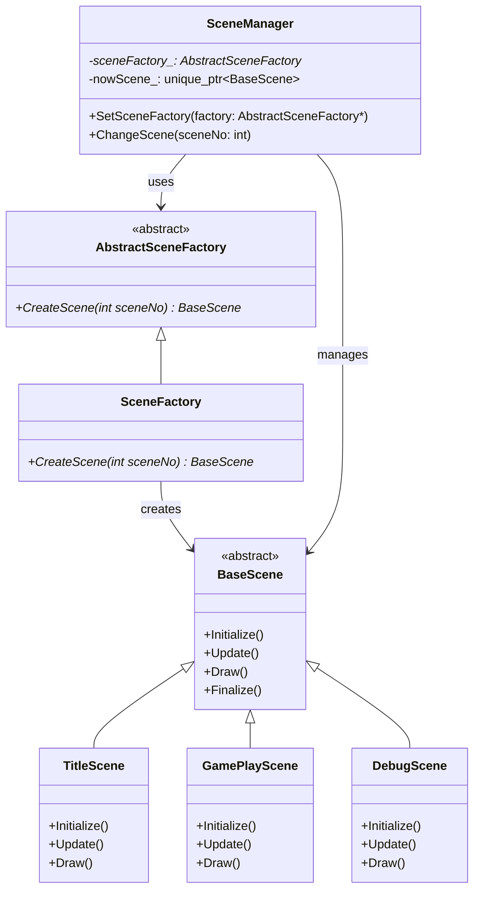
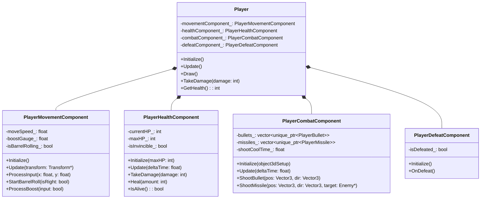
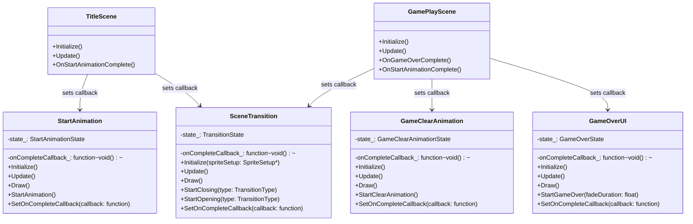
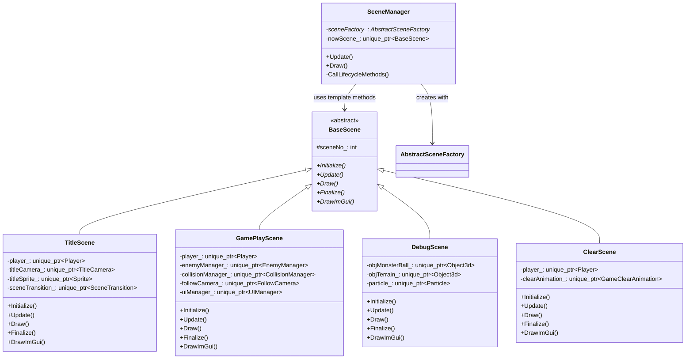
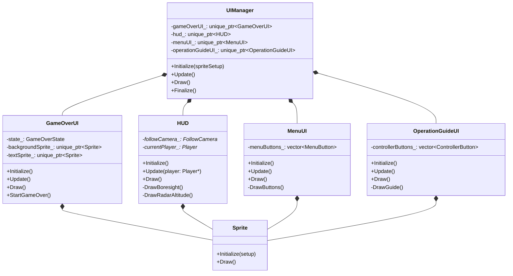
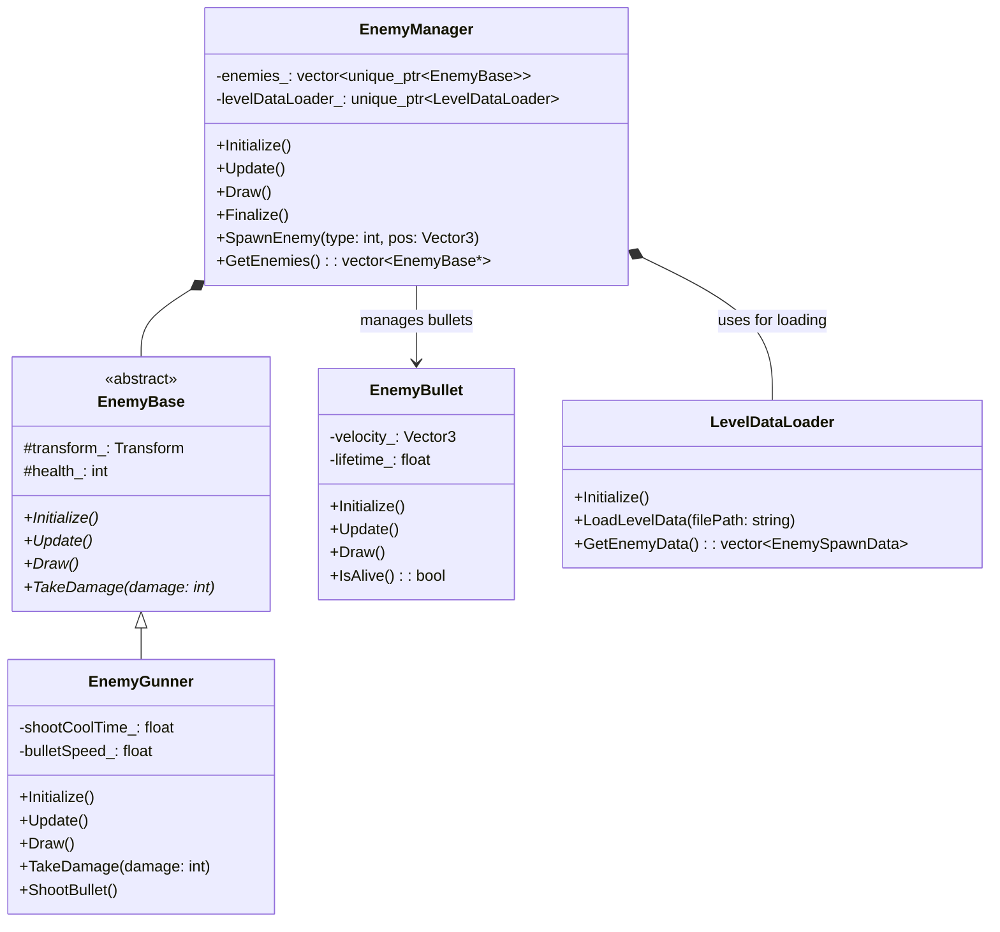
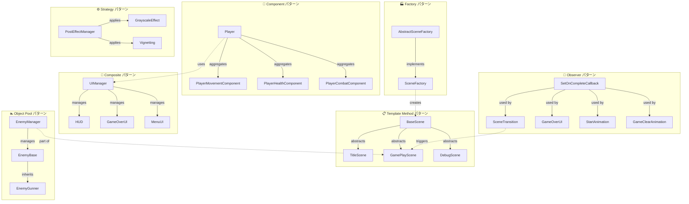

# MagEngine デザインパターン クラス図

このドキュメントは、MagEngine に実装されているデザインパターンをマーメイド記法で表現したクラス図をまとめたものです。

---

## 1. Factory パターン - シーン生成



**目的**:
- シーン生成の一元化
- 新しいシーンスの追加が容易
- SceneManager がシーン生成の詳細に依存しない設計

---

## 2. Component パターン - プレイヤー機能分割



**目的**:
- 複雑な Player クラスの責任分離
- 各機能の独立管理と再利用性向上
- 個別コンポーネントの単体テスト容易化
- 単一責任の原則に従った設計

---

## 3. Observer パターン - コールバック/イベント駆動



**目的**:
- イベント駆動の設計実現
- イベント発生者とリスナーの疎結合化
- 完了後の処理を動的に定義可能
- シーン遷移やアニメーション完了時の処理を委譲

---

## 4. Template Method パターン - シーンのライフサイクル



**目的**:
- すべてのシーンに統一したライフサイクルを適用
- シーン遷移時の処理フロー（初期化→更新→描画→終了化）を標準化
- SceneManager がシーン詳細を知らずに統一インタフェースで操作可能
- ポリモーフィズムを活用した柔軟な設計

---

## 5. Composite パターン - UI要素の一元管理



**目的**:
- UI要素の一元管理
- UI要素の階層的構造管理
- 個別UIと複数UIの操作を同じインタフェースで処理可能
- UI更新・描画の統一化

---

## 6. Strategy パターン - ポストエフェクト管理

```mermaid
classDiagram
    class PostEffectManager {
        -grayscaleEffect_: unique_ptr~GrayscaleEffect~
        -vignetting_: unique_ptr~Vignetting~
        -effectChain_: vector~EffectType~
        +Initialize()
        +Update()
        +Draw()
        +ApplyEffect(type: EffectType)
        +RemoveEffect(type: EffectType)
    }
    
    class PostEffect {
        <<abstract>>
        +Initialize()*
        +Update()*
        +Draw()*
        +Apply()*
    }
    
    class GrayscaleEffect {
        -intensity_: float
        +Initialize()
        +Update()
        +Draw()
        +Apply()
        +SetIntensity(value: float)
    }
    
    class Vignetting {
        -intensity_: float
        -radius_: float
        +Initialize()
        +Update()
        +Draw()
        +Apply()
        +SetIntensity(value: float)
    }
    
    enum EffectType {
        Grayscale
        Vignetting
    }
    
    PostEffect <|-- GrayscaleEffect
    PostEffect <|-- Vignetting
    PostEffectManager --> PostEffect : manages
    PostEffectManager --> EffectType : uses
```

**目的**:
- エフェクトの動的切り替え
- 新しいエフェクト追加時に既存コード変更を最小化
- 複数のエフェクトを組み合わせて使用可能
- エフェクトの再利用性向上

---

## 7. Object Pool パターン - 敵管理システム



**目的**:
- メモリ割当解放のオーバーヘッド削減
- 敵オブジェクトの効率的な一括管理
- 敵の生成・更新・描画を集中管理
- パフォーマンス最適化

---

## 8. MagEngine デザインパターン全体構成



---

## デザインパターン適用効果

| パターン | 効果 | 実装箇所 |
|---------|------|--------|
| **Factory** | シーン生成の一元化、拡張性向上 | `scene/base/SceneFactory` |
| **Component** | 責任分離、再利用性、テスト容易性 | `application/player/component/` |
| **Observer** | イベント駆動設計、疎結合性 | `application/SceneTransition.h` など |
| **Strategy** | エフェクト管理の柔軟性、拡張性 | `engine/postEffect/` |
| **Template Method** | 処理フローの統一化、ポリモーフィズム | `scene/base/BaseScene.h` |
| **Composite** | UI要素の統一管理、階層構造 | `application/ui/UIManager.h` |
| **Object Pool** | メモリ効率化、パフォーマンス最適化 | `application/enemy/EnemyManager.h` |

---

## 利点と特徴

### 🎯 構造的メリット
- **低結合度**: 各パターンが独立して機能
- **高凝集度**: 関連する処理が集約されている
- **拡張性**: 新機能追加時の既存コード変更を最小化

### 🔧 保守性向上
- **責任分離**: 各クラスが明確な責任を持つ
- **理解容易性**: パターンに基づいた設計で理解が容易
- **テスト容易性**: 個別コンポーネントの単体テスト可能

### 🚀 開発効率性
- **再利用性**: コンポーネント・パターンの再利用
- **スケーラビリティ**: 新しいシーン・敵・UI の追加が容易
- **保守コスト削減**: 設計パターンの明確化により修正が局所化

---

## 参考資料

詳細な実装については、以下のドキュメントを参照してください：
- [DESIGN_PATTERNS.md](DESIGN_PATTERNS.md) - パターンの詳細説明
- [ENGINE_DESIGN_DOCUMENT.md](ENGINE_DESIGN_DOCUMENT.md) - エンジン設計ドキュメント
- [CLASS_DESIGN_DOCUMENT.md](CLASS_DESIGN_DOCUMENT.md) - クラス設計ドキュメント
