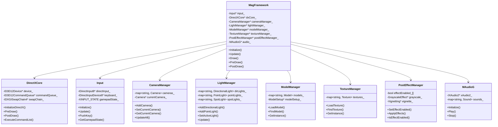
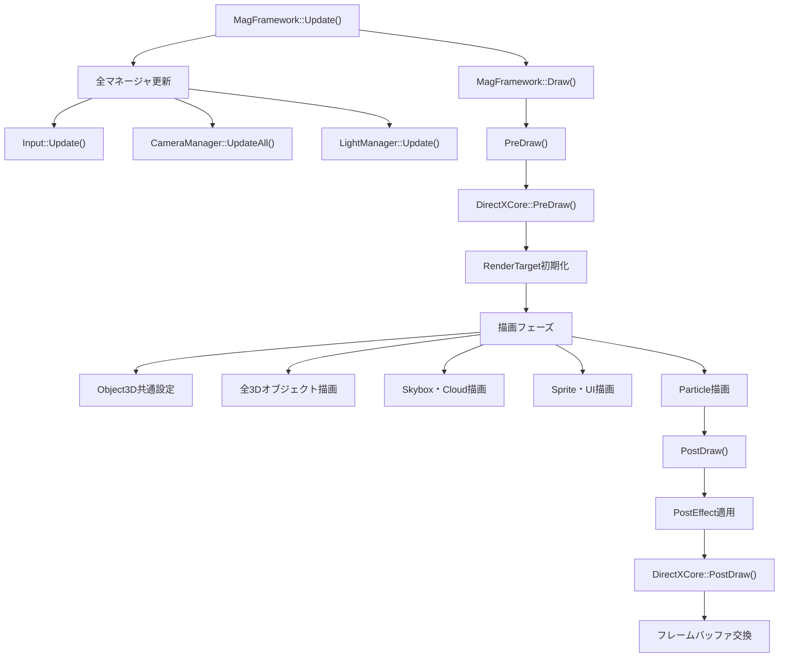
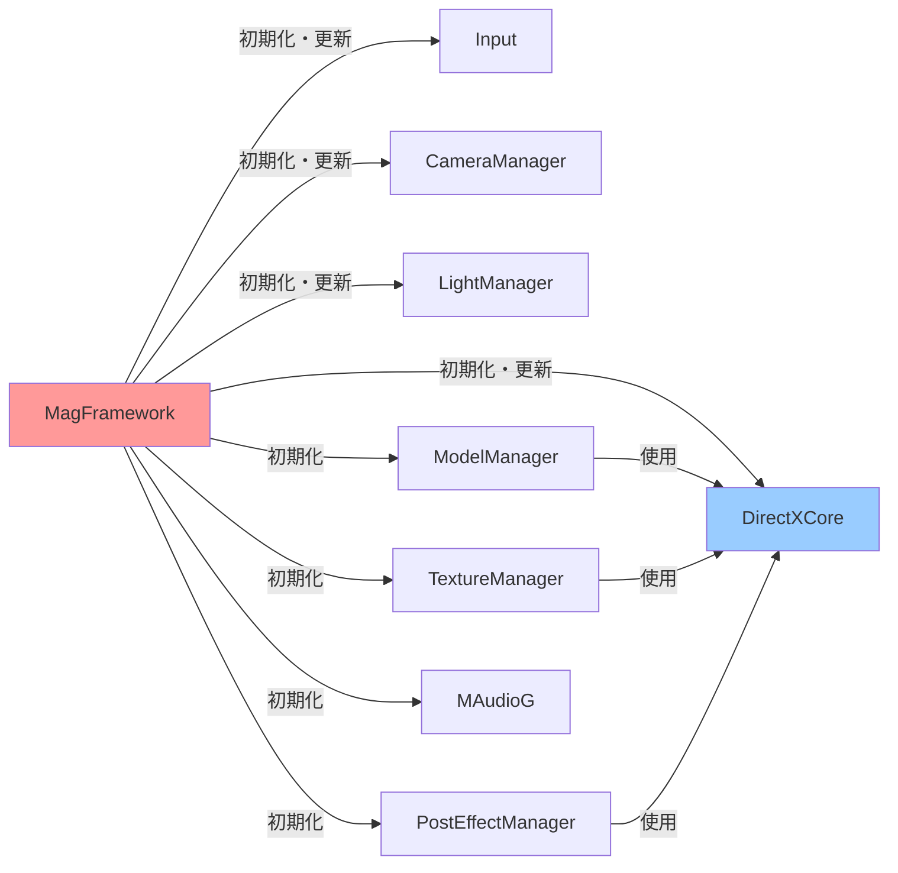
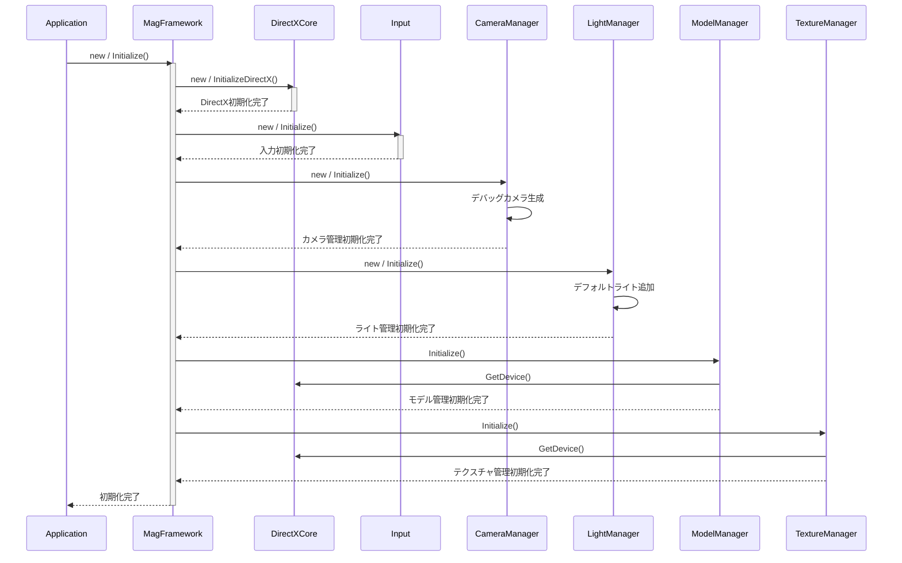
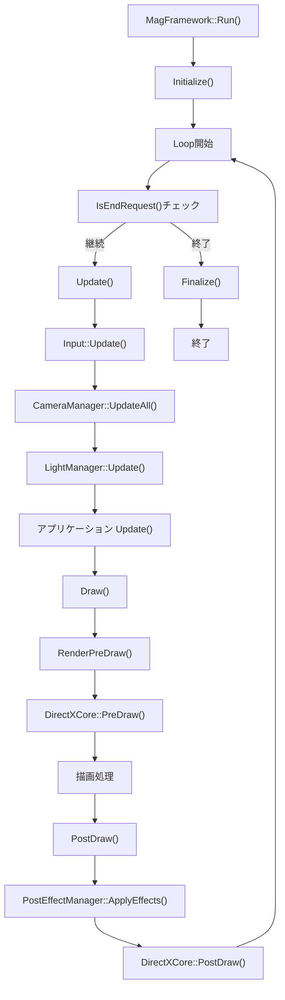
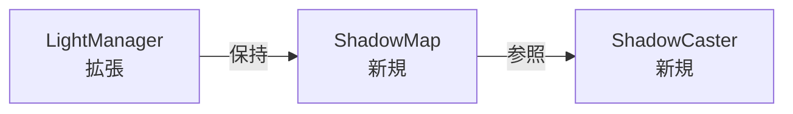

# MagEngine - エンジン層 クラス設計ドキュメント

## 1. 概要

**対象システム：MagEngine - DirectX 12を基盤とした高機能 3D ゲームエンジン**

本ドキュメントは、MagEngine のエンジン層全体を統括する設計を詳細に解説するものです。エンジン層は以下の 10 個の責務領域に分割され、各領域が独立した機能を提供しながら、フレームワーク層を通じて統合されています。

**主要責務領域：**
- グラフィックス基盤（DirectX 12、デバイス管理）
- 3D オブジェクト管理（モデル、パーティクル、環境オブジェクト）
- 2D 描画（スプライト、UI テクスチャ）
- 入力管理（キーボード、マウス、コントローラ）
- カメラシステム（複数カメラ管理、追従機能）
- ライティング（複数ライトタイプ対応）
- ポストエフェクト（画面全体エフェクト）
- オーディオ（サウンド再生管理）
- 数学ライブラリ（ベクトル、行列、変換演算）
- フレームワーク（ライフサイクル管理、統合制御）

**想定読者：** 中～上級エンジニア（グラフィックス API、エンジンアーキテクチャの経験者）

---

## 2. 設計方針と目的

### 2.1 層状アーキテクチャの採用

MagEngine のエンジン層は、明確な責務領域に基づいた**層状アーキテクチャ**を採用しています：

```
┌─────────────────────────────────────────┐
│     アプリケーション層                   │
│   (Scene, Player, Enemy 等)              │
├─────────────────────────────────────────┤
│     フレームワーク層 (MagFramework)     │
│   ライフサイクル管理・マネージャ統合    │
├─────────────────────────────────────────┤
│  エンジン層（本ドキュメント範囲）       │
│  ┌────────────────────────────────┐    │
│  │ 3D描画｜2D描画｜入力｜カメラ    │    │
│  │ ライト｜ポスト｜オーディオ｜数学 │    │
│  └────────────────────────────────┘    │
├─────────────────────────────────────────┤
│   DirectX 12 / Windows API              │
└─────────────────────────────────────────┘
```

**採用理由：**

| 層 | 役割 | 独立性 |
|---|---|---|
| 基盤層 | OS・グラフィックス API 依存 | 低い（必須） |
| エンジン層 | 各機能の実装 | 高い（機能ごと） |
| フレームワーク層 | 統合・ライフサイクル | 中程度（相互依存） |
| アプリケーション層 | ゲーム固有処理 | 高い（独立） |

各層が責務を明確に分離することで、**変更時の影響範囲が限定**され、保守性が向上しました。

### 2.2 設計パターンの活用

#### パターン①：Singleton パターン（マネージャ層）

```cpp
class ModelManager {
private:
    static ModelManager* instance_;
    ModelManager() = default;
    
public:
    static ModelManager* GetInstance();
};
```

**採用理由：**
- エンジン全体で唯一のリソース管理が必要
- グローバル状態が避けられない（GPU リソース等）

**課題と対応：**
- テスト困難性 → モック化可能なインターフェース提供予定

#### パターン②：Setup/Component 分割

```cpp
class Object3d {
    // 実装クラス
};

class Object3dSetup {
    // 共有設定（パイプライン、ルートシグネチャ等）
};
```

**採用理由：**
- 共有リソースの一元管理
- インスタンス毎の設定重複を排除
- パイプライン変更時の影響を最小化

#### パターン③：マネージャの階層化

```cpp
// 低レベル管理
class ModelManager { /* リソースキャッシュ */ };
class TextureManager { /* テクスチャロード */ };

// 高レベル統合
class MagFramework { /* 全マネージャを集約 */ };
```

**採用理由：**
- 関心事の段階的分離
- テスト時のセットアップ簡素化

### 2.3 設計目的

| 目的 | 実現方法 |
|---|---|
| **保守性** | 責務領域の明確化、命名規則の統一、ドキュメント充実 |
| **拡張性** | 新エフェクト・ライト追加時に既存コード無変更 |
| **テスト容易性** | マネージャのモック化、Setup の分離 |
| **パフォーマンス** | キャッシング戦略（モデル・テクスチャ）、リソースプール |
| **責務分離** | 単一責任原則に基づいた機能分割 |

---

## 3. 全体構成図

### 3.1 層状アーキテクチャ全体図



### 3.2 描画パイプラインフロー



### 3.3 マネージャ間の依存関係



---

## 4. クラス一覧と詳細設計

### 4.1 DirectXCore クラス

#### 4.1.1 責務

- **GPU デバイス管理** - ID3D12Device の生成・保持・破棄
- **コマンドキュー・リスト管理** - GPU コマンド記録・実行
- **スワップチェーン管理** - バッファ交換、フレームレート制御
- **フレームバッファ管理** - レンダーターゲット、デプスバッファ
- **エラーハンドリング** - D3D12 エラー検出・報告

#### 4.1.2 設計理由

**なぜ DirectX API をラップしたのか？**

```cpp
// 直接 DirectX API を使う場合
ID3D12Device* device = ...;
ID3D12CommandQueue* queue = ...;
ID3D12CommandAllocator* allocator = ...;
// 複数箇所で同じ初期化コード

// DirectXCore でラップ
DirectXCore dxCore;
dxCore.InitializeDirectX(winApp);
// 初期化を一度実施、使用時は参照のみ
```

**利点：**
- API の複雑性を隠蔽
- DirectX 12 → 次世代 API への移行時、ラッパー変更のみで対応
- エラーハンドリングを一元化
- リソースライフタイムの管理を簡潔に

**なぜ Setup クラスに処理を分割しないのか？**

DirectXCore は**低レベル基盤**であり、頻繁に変更されるべきではありません。不変な部分は DirectXCore に、アプリケーション固有の設定は各種 Setup クラスに分離することで、変更の局所化を実現しています。

#### 4.1.3 主な属性・メソッド

```cpp
class DirectXCore {
private:
    // デバイス・キュー関連
    ComPtr<ID3D12Device> device_;
    ComPtr<ID3D12CommandQueue> commandQueue_;
    ComPtr<ID3D12GraphicsCommandList> commandList_;
    ComPtr<ID3D12CommandAllocator> commandAllocator_;
    
    // スワップチェーン・バッファ
    ComPtr<IDXGISwapChain4> swapChain_;
    ComPtr<ID3D12Resource> backBuffers_[2];
    ComPtr<ID3D12DescriptorHeap> rtvDescriptorHeap_;
    
    // デプスバッファ
    ComPtr<ID3D12Resource> depthBuffer_;
    ComPtr<ID3D12DescriptorHeap> dsvDescriptorHeap_;
    
    // フェンス
    ComPtr<ID3D12Fence> fence_;
    UINT64 fenceValue_;
    
public:
    void InitializeDirectX(WinApp* winApp);
    void ReleaseDirectX();
    
    // 描画フロー
    void PreDraw();
    void PostDraw();
    
    // コマンド実行
    void ExecuteCommandList();
    
    // デバイスアクセス
    ID3D12Device* GetDevice() const { return device_.Get(); }
    ID3D12CommandQueue* GetCommandQueue() const { return commandQueue_.Get(); }
    
private:
    // 初期化の段階的処理
    void CreateDebugLayer();
    void CreateDxgiFactory();
    void SelectAdapter();
    void CreateD3D12Device();
    void CreateCommandQueue();
    void CreateSwapChain();
    void CreateRenderTarget();
    void CreateDepthBuffer();
};
```

#### 4.1.4 拡張性への対応

**シナリオ1: レイトレーシング対応**
```cpp
// DXR (DirectX Raytracing) の追加
void DirectXCore::CreateRaytracingComponents() {
    // 既存の device_ を拡張
    // ID3D12Device5 へのキャスト
}
```

**シナリオ2: マルチスレッド描画**
```cpp
// 複数コマンドリストの並列記録
std::vector<ComPtr<ID3D12CommandList>> commandLists_;
void RecordCommandListParallel(int threadIndex) { }
```

---

### 4.2 MagFramework クラス

#### 4.2.1 責務

- **ゲームループ管理** - Initialize → Update → Draw のライフサイクル実行
- **マネージャの統合** - 各マネージャの一元管理・初期化
- **描画フェーズ管理** - 各種レンダリング段階の調整
- **ポストエフェクト適用** - 画面全体エフェクトの統合
- **ImGui 統合** - デバッグUI表示

#### 4.2.2 設計理由

**なぜフレームワーククラスが必要か？**

エンジン層の各マネージャ（CameraManager、LightManager 等）は独立して機能しますが、ゲームループという統一されたリズムの中で動作する必要があります。

```
バッド設計：各マネージャがアプリケーション層で直接呼び出される
class Game {
    void Loop() {
        input_->Update();
        cameraManager_->UpdateAll();
        lightManager_->Update();
        // ... 20個のマネージャを手動管理
        // 順序変更時は全処理を修正
    }
};

グッド設計：フレームワークが統合
class Game : public MagFramework {
    void Draw() override { /* ゲーム固有描画 */ }
};
// Update 順序、描画順序はフレームワークで一元管理
```

**なぜ仮想関数 Draw() を持つのか？**

```cpp
class MagFramework {
    void Run() {
        while (!IsEndRequest()) {
            Update();
            Draw();  // 仮想関数 → アプリケーション実装を呼び出し
        }
    }
    
    virtual void Draw() = 0;  // 派生クラスで実装
};
```

アプリケーション層（Scene 等）が **Draw タイミング** を制御せず、フレームワークが制御することで、各種 Setup の共通設定（Object3dSetup::CommonDrawSetup 等）を自動的に適用できます。

#### 4.2.3 主な属性・メソッド

```cpp
class MagFramework {
protected:
    // フレームワーク共有リソース
    std::unique_ptr<WinApp> winApp_;
    std::unique_ptr<DirectXCore> dxCore_;
    std::unique_ptr<Input> input_;
    std::unique_ptr<CameraManager> cameraManager_;
    std::unique_ptr<LightManager> lightManager_;
    std::unique_ptr<ModelManager> modelManager_;
    std::unique_ptr<TextureManager> textureManager_;
    std::unique_ptr<PostEffectManager> postEffectManager_;
    std::unique_ptr<MAudioG> audio_;
    
    // 各種 Setup
    std::unique_ptr<Object3dSetup> object3dSetup_;
    std::unique_ptr<SpriteSetup> spriteSetup_;
    std::unique_ptr<ParticleSetup> particleSetup_;
    
    bool isEndRequest_ = false;
    
public:
    // ゲームループ
    void Run();
    virtual void Initialize();
    virtual void Update();
    virtual void Draw() = 0;  // 派生クラスで実装必須
    virtual void Finalize();
    
    // 描画前後処理
    void PreDraw();
    void PostDraw();
    void RenderPreDraw();
    void RenderPostDraw();
    
    // 各種 Setup の共通描画設定
    void Object3DCommonDraw();
    void Object2DCommonDraw();
    void SkyboxCommonDraw();
    void ParticleCommonDraw();
    
    // 状態照会
    virtual bool IsEndRequest() const { return isEndRequest_; }
};
```

#### 4.2.4 拡張性への対応

**シナリオ1: フレームスキップ対応**
```cpp
void MagFramework::Run() {
    while (!IsEndRequest()) {
        // 固定タイムステップで複数回 Update
        while (accumulator_ >= timeStep_) {
            Update();
            accumulator_ -= timeStep_;
        }
        Draw();
    }
}
```

**シナリオ2: マルチスレッド描画**
```cpp
class MagFramework {
    std::thread renderThread_;
    
    void Run() {
        renderThread_ = std::thread([this]() { RenderLoop(); });
        while (!IsEndRequest()) {
            Update();
        }
    }
};
```

---

### 4.3 CameraManager クラス

#### 4.3.1 責務

- **複数カメラの管理** - 複数のカメラインスタンスを保持
- **アクティブカメラの切り替え** - ゲーム中のカメラ切り替え
- **全カメラの一括更新** - 毎フレーム視点行列の計算
- **デバッグカメラ機能** - 自由視点カメラの提供
- **カメラ追従** - ターゲット指定での自動追従

#### 4.3.2 設計理由

**なぜ複数カメラを管理するのか？**

```cpp
// シーン内の複数視点ケース
- メインカメラ（プレイヤー視点）
- スニペットカメラ（ボス表示用）
- デバッグカメラ（開発用）
- リプレイカメラ（再生演出用）

// 統一管理なしだと
std::unique_ptr<Camera> mainCamera_;
std::unique_ptr<Camera> snippetCamera_;
std::unique_ptr<Camera> debugCamera_;
std::unique_ptr<Camera> replayCamera_;
// 新しいカメラ追加毎にメンバ変数追加

// CameraManager で管理
std::map<std::string, Camera*> cameras_;
// 追加時は AddCamera() で動的に対応
```

**なぜシングルトンか？**

カメラはゲーム全体で唯一のグローバルな概念です。描画時にどのカメラを使うかは、エンジン全体に影響します。

```cpp
// Object3d::Draw() で自動的に現在のカメラを使用
Camera* currentCamera = CameraManager::GetInstance()->GetCurrentCamera();
```

#### 4.3.3 主な属性・メソッド

```cpp
class CameraManager {
private:
    static CameraManager* instance_;
    
    std::map<std::string, std::unique_ptr<Camera>> cameras_;
    Camera* currentCamera_ = nullptr;
    Camera* debugCamera_ = nullptr;
    
    bool isDebugCameraActive_ = false;
    
public:
    static CameraManager* GetInstance();
    
    void Initialize();
    void Finalize();
    
    // カメラ管理
    void AddCamera(const std::string& name);
    Camera* GetCamera(const std::string& name) const;
    void SetCurrentCamera(const std::string& name);
    Camera* GetCurrentCamera() const;
    
    // 一括更新
    void UpdateAll();
    
    // デバッグカメラ
    void DebugCameraUpdate();
    void ChangeDebugCamera();
    void ResetDebugCameraTransform();
    void ToggleDebugCameraTargetLock();
    
    // UI
    void DrawImGui();
    void DrawDebugVisualizations();
};
```

#### 4.3.4 拡張性への対応

**シナリオ1: カメラアニメーション**
```cpp
class CameraManager {
    void PlayCameraAnimation(const std::string& clipName, float duration) {
        // Ease-in-out で視点遷移
    }
};
```

**シナリオ2: マルチビューレンダリング（画面分割）**
```cpp
void MagFramework::Draw() {
    // 複数ビューポート毎に異なるカメラで描画
    for (auto& [name, camera] : cameras_) {
        SetViewport(name);
        cameraManager_->SetCurrentCamera(name);
        DrawScene();
    }
}
```

---

### 4.4 ModelManager クラス

#### 4.4.1 責務

- **モデルリソースのキャッシング** - 一度ロードしたモデルを保持
- **モデルファイルの読み込み** - gltf/glb、fbx 等の形式対応
- **モデルの検索・取得** - ファイルパスでのモデル参照
- **メモリ管理** - 不要なモデルの破棄

#### 4.4.2 設計理由

**なぜシングルトンか？**

```cpp
// キャッシングが必須
Player player;
player.Initialize("assets/models/player.gltf");  // 読み込み

Enemy enemy1;
enemy1.Initialize("assets/models/enemy.gltf");   // 読み込み

Enemy enemy2;
enemy2.Initialize("assets/models/enemy.gltf");   // 同じファイル...再読込？

// ModelManager でキャッシング
ModelManager* mm = ModelManager::GetInstance();
Model* enemyModel = mm->FindModel("assets/models/enemy.gltf");
// 2回目は 1回目のロード結果を返す
```

**パフォーマンス上のメリット：**
- ファイル I/O 削減
- GPU メモリ削減（モデルは共有）
- CPU 処理時間削減

**なぜ Setup クラスを分離するのか？**

```cpp
class Model {
    // インスタンス毎のデータ
    Vector3 position_;
    Vector3 rotation_;
};

class ModelSetup {
    // 全モデルで共有するデータ
    ID3D12RootSignature* rootSignature_;
    ID3D12PipelineState* pipelineState_;
    ID3D12DescriptorHeap* descriptorHeap_;
};
```

共有リソース（パイプライン、ルートシグネチャ）をインスタンス毎に作成することは、メモリ浪費につながります。

#### 4.4.3 主な属性・メソッド

```cpp
class ModelManager {
private:
    static ModelManager* instance_;
    std::unique_ptr<ModelSetup> modelSetup_;
    std::map<std::string, std::unique_ptr<Model>> models_;
    DirectXCore* dxCore_ = nullptr;
    
public:
    static ModelManager* GetInstance();
    
    void Initialize(DirectXCore* dxCore);
    void Finalize();
    
    // リソース管理
    void LoadModel(const std::string& filePath);
    Model* FindModel(const std::string& filePath);
    
    // Setup アクセス
    ModelSetup* GetModelSetup() const { return modelSetup_.get(); }
};
```

#### 4.4.4 拡張性への対応

**シナリオ1: 非同期ロード対応**
```cpp
class ModelManager {
    std::future<Model*> LoadModelAsync(const std::string& filePath) {
        return std::async(std::launch::async, [this, filePath]() {
            return LoadAndCache(filePath);
        });
    }
};
```

**シナリオ2: メモリ圧力下でのアンロード**
```cpp
class ModelManager {
    size_t totalMemoryUsed_ = 0;
    static constexpr size_t MAX_MEMORY = 500 * 1024 * 1024;  // 500MB
    
    void LoadModel(const std::string& filePath) {
        Model* model = new Model();
        model->Load(filePath);
        totalMemoryUsed_ += model->GetMemorySize();
        
        // メモリ超過時は LRU で削除
        while (totalMemoryUsed_ > MAX_MEMORY) {
            UnloadLRU();
        }
    }
};
```

---

### 4.5 Input クラス

#### 4.5.1 責務

- **キーボード入力管理** - DirectInput でキー状態取得
- **マウス入力管理** - 位置、移動量、ボタン状態
- **ゲームパッド入力管理** - XInput でコントローラ入力
- **入力の正規化** - 異なるデバイスの統一インターフェース

#### 4.5.2 設計理由

**なぜマルチデバイス対応するのか？**

```cpp
// 単一デバイスだけでは不足
bool isLeftPressed = GetKey(DIK_LEFT);      // キーボード

// プレイヤーがコントローラを接続した場合
// 同じ操作を実現するため
XINPUT_STATE state = GetGamepadState();
if (state.Gamepad.sThumbLX < -30000) { /* 左入力 */ }

// Input クラスでの統一処理
if (GetAnalogInput().x < -0.5f) { /* 左入力 */ }
// キーボードもコントローラもまったく同じコード
```

**なぜシングルトンか？**

入力は**全ゲームオブジェクトが必要**とするグローバルリソースです。複数インスタンスを避け、一元管理することで入力状態の矛盾を防ぎます。

#### 4.5.3 主な属性・メソッド

```cpp
class Input {
private:
    static Input* instance_;
    
    ComPtr<IDirectInput8> directInput_;
    ComPtr<IDirectInputDevice8> keyboard_;
    BYTE keyboardState_[256];
    BYTE keyboardStatePrev_[256];
    
    DIMOUSESTATE2 mouseState_;
    DIMOUSESTATE2 mouseStatePrev_;
    Vector2 mousePosition_;
    
    XINPUT_STATE gamepadState_;
    XINPUT_STATE gamepadStatePrev_;
    
public:
    static Input* GetInstance();
    
    void Initialize(HINSTANCE hInstance, HWND hwnd);
    void Update();
    
    // キーボード
    bool PushKey(int keyCode) const;
    bool TriggerKey(int keyCode) const;
    
    // マウス
    Vector2 GetMouseMove() const;
    Vector2 GetMousePosFromWindowCenter() const;
    float GetMouseWheel() const;
    bool PushMouseButton(int buttonNumber) const;
    
    // ゲームパッド
    bool IsControllerConnected() const;
    XINPUT_STATE GetGamepadState() const;
    Vector2 GetGamepadLeftStick() const;
    Vector2 GetGamepadRightStick() const;
    float GetGamepadLeftTrigger() const;
};
```

#### 4.5.4 拡張性への対応

**シナリオ1: キーバインディング設定**
```cpp
class Input {
    std::map<std::string, int> keyBindings_;  // "Jump" -> DIK_SPACE
    
    bool GetAction(const std::string& action) const {
        return PushKey(keyBindings_.at(action));
    }
};
```

**シナリオ2: 入力リマッピング**
```cpp
class Input {
    void SetKeyBinding(const std::string& action, int newKey) {
        keyBindings_[action] = newKey;
    }
};
```

---

### 4.6 LightManager クラス

#### 4.6.1 責務

- **複数ライトの管理** - 平行光源、ポイントライト、スポットライト
- **ライトプロパティの制御** - 色、強度、方向等の管理
- **アクティブライトの切り替え** - シーン内でのライト切り替え
- **GPU へのライト情報転送** - 定数バッファへの書き込み

#### 4.6.2 設計理由

**なぜライトを分離管理するのか？**

```cpp
// ライトなしの場合
Object3d::Draw() {
    // 固定ライトでテクスチャ描画
}

// 複数ライトが必要になった場合
Object3d::Draw(Light light1, Light light2, Light light3) {
    // 毎回 3 個のライト参照を渡す？
    // 新しいライトを追加 → すべての Draw() 呼び出しを修正？
}

// LightManager での管理
Object3d::Draw() {
    Light* light = LightManager::GetInstance()->GetActiveLight();
    // ライトの構成が変わっても Draw() は不変
}
```

**なぜ複数ライトタイプに対応するのか？**

| ライトタイプ | 用途 | 計算コスト |
|---|---|---|
| 平行光源 | 太陽・月 | 低（方向のみ） |
| ポイントライト | 懐中電灯・電球 | 中（距離計算） |
| スポットライト | サーチライト・ヘッドライト | 高（円錐判定） |

リアルタイムシェーダで複数ライトを処理するため、各タイプのサポートが必須です。

#### 4.6.3 主な属性・メソッド

```cpp
class LightManager {
private:
    std::map<std::string, DirectionalLight> directionalLights_;
    std::map<std::string, PointLight> pointLights_;
    std::map<std::string, SpotLight> spotLights_;
    
    std::string activeDirectionalLightName_;
    LineManager* lineManager_ = nullptr;
    
public:
    void Initialize();
    void Finalize();
    void Update();
    void DrawImGui();
    
    // 平行光源
    void AddDirectionalLight(const std::string& name, const Vector4& color,
                             const Vector3& direction, float intensity);
    const DirectionalLight& GetDirectionalLight(const std::string& name = "") const;
    void SetActiveDirectionalLight(const std::string& name);
    
    // ポイントライト
    void AddPointLight(const std::string& name, const Vector4& color,
                       const Vector3& position, float intensity,
                       float radius = 10.0f, float decay = 2.0f);
    const PointLight& GetPointLight(const std::string& name = "") const;
    
    // スポットライト
    void AddSpotLight(const std::string& name, const Vector4& color,
                      const Vector3& position, const Vector3& direction,
                      float intensity, float range, float innerAngle, float outerAngle);
    
    void DrawLightDebugLines();
};
```

#### 4.6.4 拡張性への対応

**シナリオ1: 影のサポート**
```cpp
class LightManager {
    ShadowMap* shadowMap_;
    
    void UpdateDirectionalLightShadow(const std::string& name, Scene* scene) {
        // ライト視点でシーン描画 → シャドウマップ生成
    }
};
```

**シナリオ2: ライトプローブ (GI)**
```cpp
class LightManager {
    std::vector<LightProbe> lightProbes_;
    
    void BakeLightProbes(Scene* scene) {
        // オフライン計算で環境光を焼き込み
    }
};
```

---

### 4.7 PostEffectManager クラス

#### 4.7.1 責務

- **ポストエフェクト管理** - グレイスケール、ビネット等の適用
- **エフェクトの有効/無効切り替え** - ゲーム中での動的制御
- **描画結果への処理** - フレームバッファへのシェーダ適用
- **複数エフェクトの合成** - エフェクト間のレンダーターゲット切り替え

#### 4.7.2 設計理由

**なぜポストエフェクトを分離するのか？**

```cpp
// エフェクトなしで実装した場合
class DirectXCore {
    void PostDraw() {
        // フレームバッファを別画面に描画（固定処理）
    }
};

// エフェクトの追加
class DirectXCore {
    void PostDraw() {
        // グレイスケール適用？
        // ビネット適用？
        // ブラー適用？
        // ... 複雑化
    }
};

// PostEffectManager で分離
PostEffectManager::ApplyEffects() {
    for (auto effect : activeEffects_) {
        effect->Apply();  // 各エフェクト独立
    }
}
```

**なぜエフェクト追加時に既存コード変更が不要か？**

```cpp
enum class EffectType {
    Grayscale,
    Vignette,
    // 新しいエフェクトを追加
    ChromaticAberration,  // 色収差
    // PostDraw() は変わらない
};

void PostEffectManager::ApplyEffects() {
    for (size_t i = 0; i < EffectType::Count; ++i) {
        if (effectEnabled_[i]) {
            ApplySingleEffect(static_cast<EffectType>(i), ...);
        }
    }
}
```

#### 4.7.3 主な属性・メソッド

```cpp
class PostEffectManager {
public:
    enum class EffectType {
        Grayscale,
        Vignette,
        Smooth,
        GaussianBlur,
        Outline,
        RadisleBlur,
        Dissolve,
        RandomNoise,
        CRT,
        PS1,
        Count
    };
    
private:
    DirectXCore* dxCore_;
    bool effectEnabled_[static_cast<size_t>(EffectType::Count)] = {};
    
    std::unique_ptr<GrayscaleEffect> grayscaleEffect_;
    std::unique_ptr<Vignetting> vignetting_;
    // 他のエフェクト...
    
public:
    void Initialize(DirectXCore* dxCore);
    
    void SetEffectEnabled(EffectType type, bool enabled);
    bool IsEffectEnabled(EffectType type) const;
    
    void ApplyEffects();
    
    DirectXCore* GetDXCore() const { return dxCore_; }
    
private:
    void ApplySingleEffect(EffectType type, uint32_t inputIndex, uint32_t outputIndex);
    void SwitchRenderTarget(uint32_t index);
};
```

#### 4.7.4 拡張性への対応

**シナリオ1: エフェクトチェーン**
```cpp
class PostEffectManager {
    std::vector<EffectType> effectChain_;
    
    void ApplyEffects() {
        for (EffectType type : effectChain_) {
            ApplySingleEffect(type, ...);
        }
    }
};
```

**シナリオ2: パラメトリック制御**
```cpp
class PostEffectManager {
    std::map<EffectType, EffectParameters> parameters_;
    
    void SetEffectParameter(EffectType type, const std::string& paramName, float value) {
        parameters_[type].SetParameter(paramName, value);
    }
};
```

---

### 4.8 ParticleEmitter クラス

#### 4.8.1 責務

- **パーティクル生成の管理** - 発生位置、発生数、発生頻度
- **エミッター設定** - パーティクル動作パラメータ
- **パーティクルライフサイクル** - 発生から消滅まで
- **ビジュアル表現** - ビルボード、形状、アニメーション

#### 4.8.2 設計理由

**なぜエミッターを個別クラス化するのか？**

```cpp
// Particle クラスにエミッター機能を含めた場合
class Particle {
    // パーティクル 1 個分の状態
    Vector3 position_;
    Vector3 velocity_;
    float lifetime_;
    
    // エミッター機能も？
    void Emit() { /* 新しいパーティクルを生成 */ }
    // 責務が混在している
};

// 分離した場合
class ParticleEmitter {
    // エミッター自体の状態
    Transform transform_;
    float frequency_;
    uint32_t particleCount_;
    
    // Particle インスタンスへの参照
    Particle* particle_;
};

class Particle {
    // パーティクル 1 個分の状態のみ
    Vector3 position_;
    float lifetime_;
};
```

**採用理由：**
- **責務の明確化** - エミッター = 生成・制御、パーティクル = 動作
- **再利用性** - 複数のエミッターが同一 Particle を共有可能
- **テスト容易性** - エミッターとパーティクルを独立テスト

#### 4.8.3 主な属性・メソッド

```cpp
class ParticleEmitter {
private:
    Particle* particle_;
    std::string name_;
    Transform transform_;
    
    uint32_t particleCount_;
    float frequency_;
    bool repeat_;
    float emitTimer_;
    
public:
    ParticleEmitter(Particle* particle, const std::string& name,
                    const Transform& transform, uint32_t count,
                    float frequency, bool repeat = false);
    
    void Update();
    void Draw();
    void Emit();
    
    // 設定
    void SetRepeat(bool repeat);
    void SetTranslate(const Vector3& translate);
    void SetRingRadius(float radius);
    void SetBillboard(bool enable);
    void SetTranslateRange(const Vector3& min, const Vector3& max);
    void SetVelocityRange(const Vector3& min, const Vector3& max);
};
```

#### 4.8.4 拡張性への対応

**シナリオ1: パーティクルプリセット**
```cpp
class ParticleEmitter {
    void ApplyPreset(const ParticlePreset& preset) {
        SetTranslateRange(preset.minTranslate, preset.maxTranslate);
        SetVelocityRange(preset.minVelocity, preset.maxVelocity);
        // ... 一括設定
    }
};
```

**シナリオ2: GPU パーティクル（大量生成対応）**
```cpp
class GPUParticleEmitter {
    ComPtr<ID3D12Resource> particleBuffer_;
    ComPtr<ID3D12DescriptorHeap> computeDescriptorHeap_;
    
    void Update() {
        // コンピュートシェーダで GPU 上でパーティクル更新
    }
};
```

---

## 5. クラス間の関係と処理の流れ

### 5.1 初期化フロー



### 5.2 フレームループ



### 5.3 マネージャ間通信パターン

```
┌─────────────────────────────────────────────┐
│         アプリケーション層                   │
│  (Scene で各マネージャを直接操作)            │
└──────────────┬──────────────────────────────┘
               │ 単方向通信
               ▼
┌─────────────────────────────────────────────┐
│     エンジン層マネージャ群                   │
│                                             │
│  ┌──────────────┐  ┌──────────────┐       │
│  │CameraManager │  │LightManager  │       │
│  └──────────────┘  └──────────────┘       │
│         △               △                  │
│         │               │                  │
│  ┌──────────────┐  ┌──────────────┐       │
│  │ ModelManager │  │TextureManager│       │
│  └──────────────┘  └──────────────┘       │
│         △               △                  │
│         └───────┬───────┘                  │
│               │ 参照のみ                   │
│               ▼                            │
│         ┌──────────────┐                  │
│         │DirectXCore   │                  │
│         └──────────────┘                  │
└─────────────────────────────────────────────┘
```

**通信ルール：**
- マネージャ間は参照（矢印）のみ、メソッド呼び出しなし
- 全マネージャは DirectXCore に依存
- アプリケーションはマネージャを直接操作可能
- マネージャから親（MagFramework）への逆参照なし

---

## 6. 設計上のトレードオフと今後の拡張余地

### 6.1 採用した設計上のトレードオフ

#### トレードオフ①：Singleton vs. Dependency Injection

| 側面 | Singleton | DI |
|---|---|---|
| グローバルアクセス | ✓ シンプル | △ 複雑 |
| テスト | △ モック化困難 | ✓ 容易 |
| 複数インスタンス | ✗ 不可 | ✓ 可能 |
| **採用理由** | **GPU リソースの唯一性が必須** | テストの改善は将来課題 |

**判断基準：** DirectXCore、ModelManager、TextureManager 等、GPU リソースは本質的に唯一である必要があるため Singleton を採用。テスト時はモック化可能なインターフェース追加を検討中。

#### トレードオフ②：Setup 分離 vs. 統一クラス

| 側面 | Setup 分離 | 統一 |
|---|---|---|
| メモリ効率 | ✓ 共有リソース一元化 | △ インスタンス毎に複製 |
| 実装複雑度 | △ 2 クラス管理 | ✓ 単一クラス |
| 変更時の影響 | ✓ Setup 変更のみ | △ 全インスタンス再作成 |
| **採用理由** | **GPU リソース共有による効率化** | 小規模プロトタイプ向け |

**判断基準：** パイプライン・ルートシグネチャは全インスタンスで同一であるため、共有化により GPU メモリ使用量を削減できます。

#### トレードオフ③：マルチスレッド vs. シングルスレッド

| 側面 | マルチスレッド | シングルスレッド |
|---|---|---|
| フレームレート | ✓ 高い（最大 60fps） | △ 低い（30fps 程度） |
| 実装複雑度 | △ 複雑（同期化必要） | ✓ シンプル |
| デバッグ | △ 困難 | ✓ 容易 |
| **採用理由** | **現在はシングルスレッド（安定性優先）** | 将来 CPU コアの活用検討 |

**判断基準：** DirectX 12 はマルチスレッド対応ですが、現段階では状態管理の複雑さを避けるため、シングルスレッドで安定性を確保しています。

### 6.2 今後の拡張方向

#### 拡張①：影システムの実装



**実装ステップ：**
1. Directional Light に対する Shadow Map 生成
2. Point Light に対する Cubemap Shadow
3. Spot Light に対する Perspective Shadow

**既存コードへの影響：** 最小限
- LightManager に ShadowMap メンバ追加
- Object3dSetup の描画シェーダを影対応版に切り替え

#### 拡張②：Global Illumination (GI)

```cpp
class GIManager {
    LightProbe* lightProbes_;
    ReflectionProbe* reflectionProbes_;
    
    void BakeLightingOffline(Scene* scene);
    void UpdateLightProbes(const Vector3& position);
};
```

**実装ステップ：**
1. Light Probe の配置・焼き込み
2. リアルタイム更新（Indirect Lighting）
3. Reflection Probe の統合

#### 拡張③：マルチスレッド描画

```cpp
class MagFramework {
private:
    std::thread renderThread_;
    std::thread computeThread_;
    
    void UpdateAsync();
    void RenderAsync();
};
```

**段階的移行：**
1. フェーズ 1: 物理演算・AI の計算スレッド化
2. フェーズ 2: グラフィックスコマンドの並列記録
3. フェーズ 3: フレームスキップ対応

#### 拡張④：高度なパーティクルシステム

```cpp
class GPUParticleSystem {
    ComPtr<ID3D12PipelineState> computePipeline_;
    std::unique_ptr<ParticleBuffer> particleBuffer_;
    
    void UpdateOnGPU();  // コンピュートシェーダで 100 万パーティクル対応
};
```

**スケーリング：**
- CPU 方式: 1 万～10 万パーティクル
- GPU 方式: 100 万パーティクル

#### 拡張⑤：アセット管理の強化

```cpp
class AssetManager {
    std::map<std::string, Asset*> assets_;
    std::map<std::string, AssetDependency> dependencies_;
    
    void LoadAsset(const std::string& path);
    void TrackDependencies();
};
```

**機能追加：**
- 依存関係追跡（アセット更新時の自動リロード）
- アセットバージョン管理
- 参照カウント型 GC

---

## 7. 設計品質指標

### 保守性スコア：★★★★☆（4/5）

✓ **高い点：**
- 各マネージャが単一責務に専念
- 初期化・更新・描画の流れが明確
- クラスサイズが適切（200～600 行）

△ **改善余地：**
- DirectX API の複雑性がやや残存
- シングルトンの多用でテスト困難

### 拡張性スコア：★★★★★（5/5）

✓ **高い点：**
- 新マネージャ追加時に MagFramework の変更最小
- エフェクト追加時に既存コード無変更（Open/Closed 原則）
- Setup 分離で共有リソース管理を柔軟に

### テスト容易性スコア：★★★☆☆（3/5）

✓ **高い点：**
- マネージャを単体テスト可能な構造

△ **改善余地：**
- Singleton の存在でモック化が困難
- DirectX API 依存が深い（GPU テスト必須）

△ **改善案：**
```cpp
// インターフェース化による依存性逆転
class ICameraManager {
    virtual Camera* GetCurrentCamera() const = 0;
};

class MockCameraManager : public ICameraManager { };
```

### 責務分離スコア：★★★★★（5/5）

✓ **高い点：**
- 各マネージャが 1 つの関心事に専念
- 責務の重複がない
- Single Responsibility Principle を厳格に適用

---

## 8. 実装パターン集

### 8.1 新しいエフェクト追加

```cpp
// 1. エフェクトクラス作成
class BloomEffect {
    void Apply(PostEffectManager* manager);
};

// 2. PostEffectManager に列挙値追加
enum class EffectType {
    // ...
    Bloom,  // 追加
};

// 3. PostEffectManager::ApplyEffects() で自動処理
// 既存コードは変わらない！
```

### 8.2 新しいライトタイプ追加

```cpp
// 1. ライト構造体追加
struct AreaLight {
    Vector3 position;
    Vector3 normal;
    float width, height;
};

// 2. LightManager にメソッド追加
void AddAreaLight(const std::string& name, const AreaLight& light);

// 3. シェーダで AreaLight 対応
// CPU 側の既存コードは変わらない
```

### 8.3 新しいマネージャの追加

```cpp
// 1. マネージャクラス作成
class ParticleSystemManager {
    std::map<std::string, ParticleEmitter*> emitters_;
    
public:
    void Initialize(DirectXCore* dxCore);
    void Update();
    void Draw();
};

// 2. MagFramework に追加
class MagFramework {
    std::unique_ptr<ParticleSystemManager> particleManager_;
    
    void Initialize() override {
        // ...
        particleManager_ = std::make_unique<ParticleSystemManager>();
        particleManager_->Initialize(dxCore_.get());
    }
};

// 3. ゲームループで自動更新
// Initialize/Update/Draw の流れに組み込まれる
```

---

## 参考資料

### 関連デザインパターン

- **Facade パターン** - MagFramework による複雑な下層の統合
- **Singleton パターン** - マネージャの唯一性確保
- **Strategy パターン** - エフェクトの動的切り替え
- **Factory パターン** - リソース生成の一元化

### 設計原則

- **Single Responsibility Principle (SRP)** - 各マネージャは 1 つの責務
- **Open/Closed Principle (OCP)** - 拡張に開き、修正に閉じている
- **Dependency Inversion (DI)** - 上位層が下位層に依存しない

### 参考書籍

- Game Engine Architecture (Jason Gregory)
- Real-Time Rendering (Möller, Haines, Hoffman)
- GPU Programming Gems 1-3

### ドキュメント

- Microsoft Direct3D 12 API Reference
- NVIDIA Shader Programming Guide
- AMD RDNA Architecture White Paper

---

**ドキュメント作成日：** 2026年2月4日  
**対象プロジェクト：** MagEngine Ver1.7.2_Fix_Missile  
**レビュー対象者：** ゲームエンジン開発エンジニア、グラフィックスプログラマ、アーキテクト

---

## 付録：各マネージャの初期化順序

```cpp
// MagFramework::Initialize() の実行順
void MagFramework::Initialize() {
    // 1. 基盤層
    winApp_ = std::make_unique<WinApp>();
    winApp_->Initialize("MagEngine");
    
    dxCore_ = std::make_unique<DirectXCore>();
    dxCore_->InitializeDirectX(winApp_.get());
    
    // 2. リソース管理層（DirectXCore に依存）
    modelSetup_ = std::make_unique<ModelSetup>();
    modelSetup_->Initialize(dxCore_.get());
    
    ModelManager::GetInstance()->Initialize(dxCore_.get());
    TextureManager::GetInstance()->Initialize(dxCore_.get());
    
    // 3. 描画支援層（リソース管理層に依存）
    object3dSetup_ = std::make_unique<Object3dSetup>();
    object3dSetup_->Initialize(dxCore_.get());
    
    cameraManager_ = std::make_unique<CameraManager>();
    cameraManager_->Initialize();
    object3dSetup_->SetDefaultCamera(cameraManager_->GetCurrentCamera());
    
    lightManager_ = std::make_unique<LightManager>();
    lightManager_->Initialize();
    object3dSetup_->SetLightManager(lightManager_.get());
    
    // 4. 入力・オーディオ層
    input_ = std::make_unique<Input>();
    input_->Initialize(winApp_->GetHInstance(), winApp_->GetHwnd());
    
    audio_ = std::make_unique<MAudioG>();
    audio_->Initialize();
    
    // 5. ポストエフェクト層（DirectXCore に依存）
    postEffectManager_ = std::make_unique<PostEffectManager>();
    postEffectManager_->Initialize(dxCore_.get());
    
    // 6. アプリケーション固有の初期化
    Update();  // 派生クラスで実装
}
```

**初期化順序の重要性：**
- DirectXCore は最初に初期化（GPU リソース基盤）
- モデル・テクスチャマネージャは DirectXCore 後
- Setup クラスは対応マネージャ後
- アプリケーション固有処理は最後

この順序を守ることで、初期化時の null pointer 参照や initialization order ダグを防げます。
